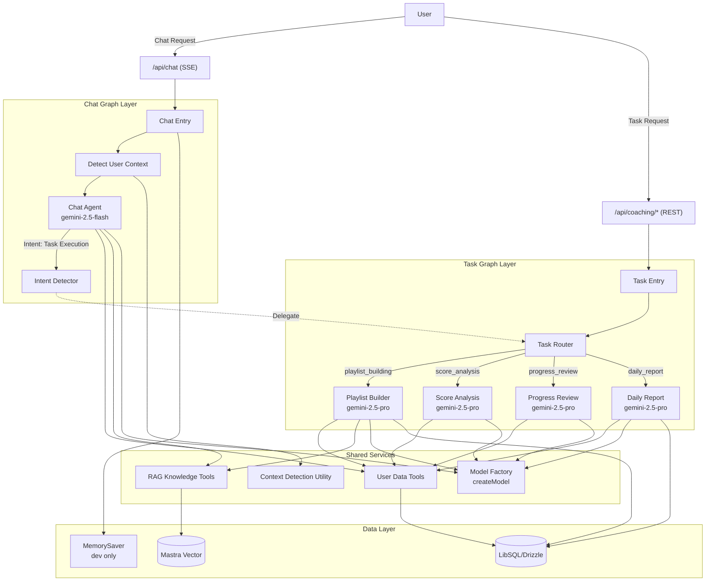
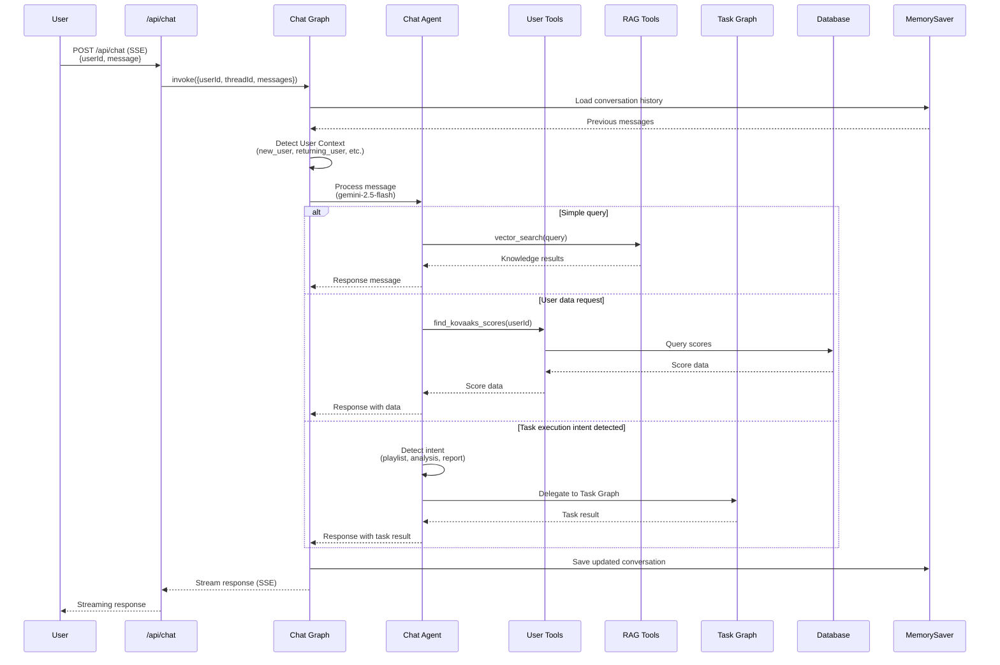
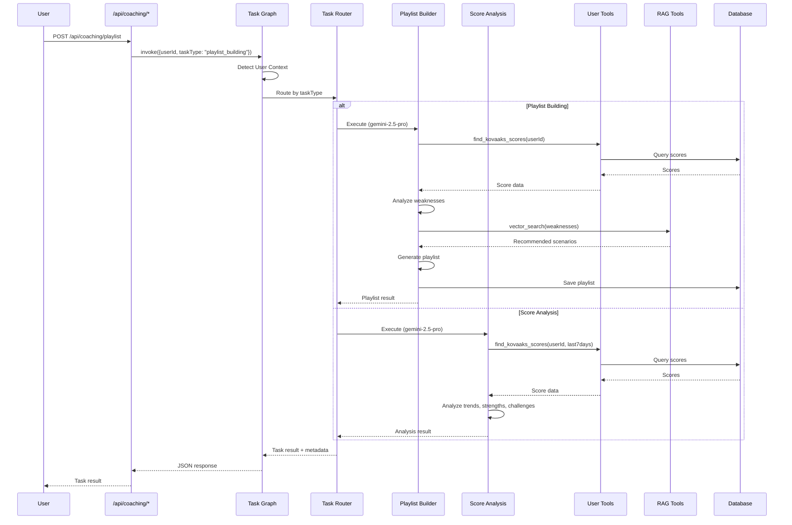
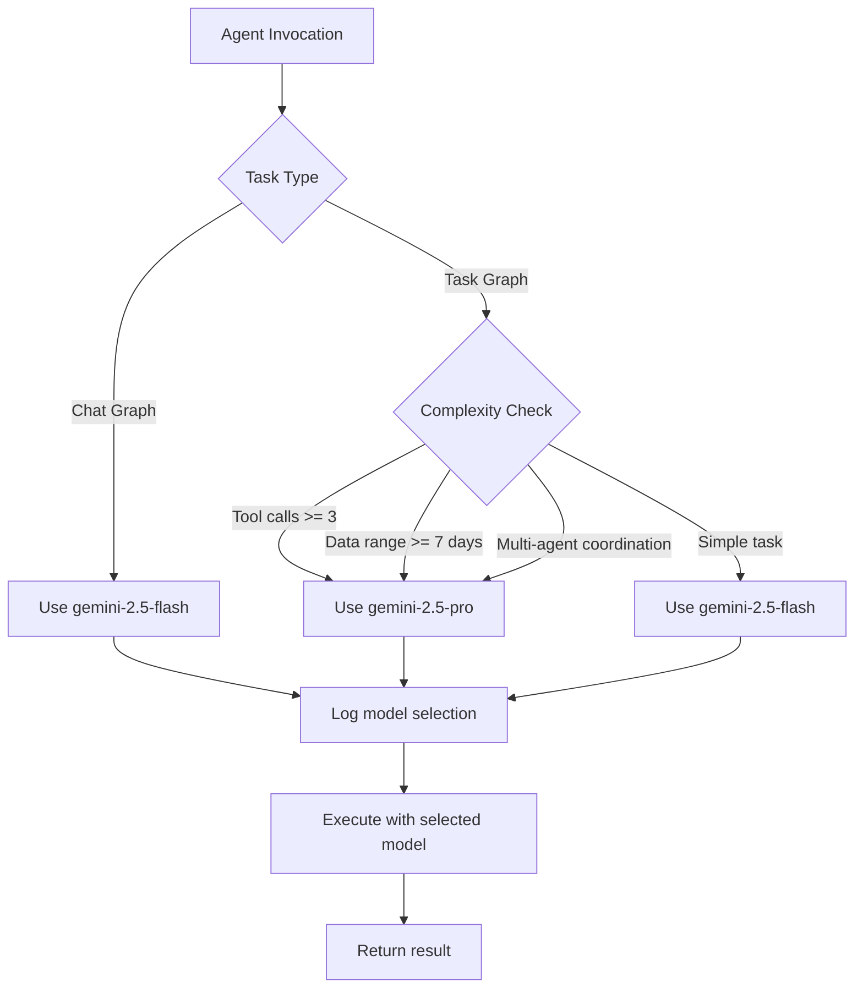
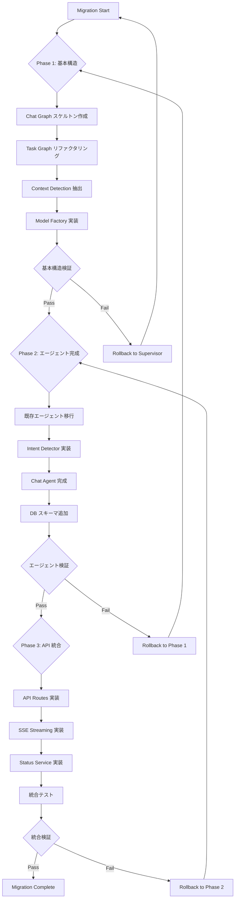

# Technical Design Document

## Overview

本設計書は、FPS プレイヤー向けのデータ駆動型エイムコーチング AI エージェントシステムの技術設計を定義します。既存の Kovaaks・Aimlabs データ統合基盤と LangGraph Supervisor Pattern を活用し、2層アーキテクチャ（Chat Graph + Task Graph）によるパーソナライズされたコーチング体験を提供します。

**Purpose**: ユーザーとの自然言語対話（チャットモード）と明示的なタスク実行（タスク実行モード）を通じて、データに基づいた客観的なエイムコーチングを提供する。

**Users**: FPS プレイヤー（初心者〜上級者）、長期休止からの復帰ユーザー、継続的な成長を目指すプレイヤー。

**Impact**: 既存の Supervisor Pattern 実装を Task Graph として再構成し、新規の Chat Graph を追加することで、会話型コーチングとタスク実行を明確に分離する。これにより、ユーザーは自由な会話と明示的な分析・レポート生成の両方のインタラクションモードを利用可能になる。

### Goals
- 2層アーキテクチャ（Chat Graph + Task Graph）による会話とタスク実行の明確な分離
- グラフタイプに基づく LLM モデル選択（Chat → gemini-2.5-flash、Task → gemini-2.5-pro）によるコスト最適化
- 既存の Supervisor Pattern アセット（フェーズ検出、専門エージェント、ツール統合）の再利用
- ユーザーコンテキスト検出によるパーソナライズされたコーチング戦略の提供
- 会話履歴の永続化と継続的なコーチング体験の実現

### Non-Goals
- 本番環境向け永続ストレージ実装（次フェーズで対応、現行は MemorySaver）
- フロントエンド UI 実装（別スコープ）
- Kovaaks・Aimlabs データ統合基盤の変更（既存基盤を利用）
- リアルタイム通知・アラート機能
- マルチテナント対応（現行は単一ユーザー想定）

## Architecture

> 詳細な調査ログと設計判断根拠は `research.md` を参照。本セクションはアーキテクチャ境界と明示的な契約に焦点を当てる。

### Existing Architecture Analysis

**既存アーキテクチャ**:
- **Supervisor Pattern**: 単一の Supervisor Graph がフェーズ検出とエージェントルーティングを担当
- **フェーズ駆動**: `CoachingPhase` に基づいて専門エージェント（Playlist Builder、Score Analysis、Progress Review、Daily Report）を選択
- **状態管理**: `SupervisorStateAnnotation` でユーザーID、メッセージ履歴、フェーズ、コンテキストフラグを管理
- **ツール統合**: `userTools`（ユーザーデータアクセス）と `createRagTools`（知識ベース検索）を Chat Agent にバインド
- **永続化**: `MemorySaver` による会話履歴の一時保存（開発環境）

**既存ドメイン境界**:
- `api/langgraph/graphs/`: グラフ定義（Supervisor Pattern）
- `api/langgraph/tools/`: LangChain ツール定義
- `api/langgraph/types.ts`: 型定義（CoachingPhase、Playlist、AnalysisResult など）
- `api/routes/coaching.ts`: API エンドポイント
- `api/mastra/`: RAG 基盤（Vector Store、YouTube、コンテンツ分析）
- `api/db/`: Drizzle ORM スキーマ（LibSQL）

**統合ポイント**:
- **再利用可能アセット**:
  - `detectPhaseNode`: ユーザー活動状況に基づくコンテキスト検出ロジック
  - 専門エージェントノード: `playlistBuilderNode`, `scoreAnalysisNode`, `progressReviewNode`, `dailyReportNode`
  - ツール定義: `userTools`, `createRagTools`
  - 型定義: `CoachingPhase`, `Playlist`, `DailyReport`, `ScoreAnalysis` など
- **技術的負債**:
  - Chat Agent が Supervisor Graph に統合されており、会話とタスク実行の責任が混在
  - モデル選択が固定（`gemini-2.0-flash-exp`）
  - 永続ストレージ未実装（MemorySaver による一時保存）

**移行戦略**:
- Hybrid Approach: 既存 Supervisor Graph を Task Graph として再構成し、Chat Graph を新規追加
- `detectPhaseNode` をコンテキスト検出ユーティリティとして抽出
- 既存専門エージェントノードを Task Graph に移行
- 新規 Chat Graph でインテント検出とルーティング機能を実装

### Architecture Pattern & Boundary Map

**選択パターン**: Multi-Layer Multi-Agent Architecture (Chat Graph + Task Graph)

**パターン選択根拠**:
- 要件で明示された「チャットモード」と「タスク実行モード」の分離を実現
- LangGraph の Supervisor Pattern と Hierarchical Multi-Agent Systems の原則に準拠
- 既存 Supervisor Graph のアセットを Task Graph として再利用



**ドメイン境界と責任分離**:

1. **Chat Graph Layer** (`api/langgraph/graphs/chat.ts`):
   - **Responsibility**: 会話型コーチング、インテント検出、ユーザーコンテキスト管理
   - **Domain Boundary**: 自然言語対話、軽量な質問応答、Task Graph への委譲判断
   - **State**: `ChatGraphState` (userId, threadId, messages, userContext)
   - **Model**: gemini-2.5-flash（軽量・高速）

2. **Task Graph Layer** (`api/langgraph/graphs/task.ts`):
   - **Responsibility**: 明示的なタスク実行（分析、レポート生成、プレイリスト構築）
   - **Domain Boundary**: データ集約、複雑な分析、構造化出力生成
   - **State**: `TaskGraphState` (userId, taskType, userContext, taskResult)
   - **Model**: gemini-2.5-pro（高性能）

3. **Shared Services** (`api/langgraph/services/`):
   - **Responsibility**: 両グラフで共通利用されるユーティリティとツール
   - **Domain Boundary**: データアクセス、知識検索、コンテキスト検出、モデル選択
   - **Components**: `userTools`, `createRagTools`, `detectUserContext`, `createModel`

4. **Data Layer**:
   - **Responsibility**: データ永続化、ベクトル検索、会話履歴管理
   - **Domain Boundary**: ストレージ抽象化、クエリ最適化
   - **Components**: Drizzle ORM (LibSQL)、Mastra Vector、MemorySaver (開発環境)

**既存パターン保持**:
- **Supervisor Pattern**: Task Graph で継続使用（タスクルーティング）
- **Tool Binding**: LangChain の `bindTools` による動的ツール注入
- **State Annotation**: LangGraph の `Annotation.Root` による型安全な状態管理
- **MemorySaver**: 開発環境での会話履歴永続化（本番は次フェーズで永続ストレージ実装）

**新規コンポーネント根拠**:
- **Chat Graph**: 要件で明示された「チャットモード」を実現、軽量モデルでコスト最適化
- **Intent Detector**: Chat Agent 内でユーザーの意図（タスク実行依頼）を検出し、Task Graph へ委譲
- **Model Factory**: タスク複雑度に基づいた動的モデル選択（flash vs pro）
- **Context Detection Utility**: 既存 `detectPhaseNode` を共通ユーティリティとして抽出

**Steering 準拠**:
- **Type Safety**: TypeScript strict mode、型定義の明示的エクスポート
- **Directory Pattern**: `api/langgraph/graphs/`, `api/langgraph/services/`, `api/langgraph/types.ts`
- **Relative Imports**: API 内部は相対パス
- **Separation of Concerns**: グラフ層、サービス層、データ層の明確な分離

### Technology Stack

**Architecture Pattern**: Multi-Layer Multi-Agent Architecture (LangGraph Supervisor Pattern + Hierarchical Multi-Agent)

**Backend Framework**: Hono
- **Role**: API ルーティング、ミドルウェア、SSE ストリーミング
- **Version**: 既存プロジェクトバージョン

**AI Orchestration**: LangGraph + LangChain
- **LangGraph**: マルチエージェントグラフオーケストレーション
- **LangChain**: ツールバインディング、メッセージハンドリング
- **Version**: `@langchain/langgraph`, `@langchain/core`, `@langchain/google-genai` (最新)

**LLM Provider**: Google Gemini
- **gemini-2.5-flash**: Chat Graph（軽量会話）、低コスト・高速
- **gemini-2.5-pro**: Task Graph（複雑分析）、高性能・高精度
- **Package**: `@langchain/google-genai` (langchain-google-genai パッケージの TypeScript 版)
- **Note**: モデル選択は `createModel` ユーティリティで動的に決定

**Database**: LibSQL (Turso) + Drizzle ORM
- **Role**: ユーザーデータ、スコアデータ、プレイリスト、レポート永続化
- **Schema**: 既存 `api/db/schema.ts` を利用

**Vector Store**: Mastra Vector
- **Role**: RAG 知識ベース（エイムコーチング、プレイリスト情報）
- **Integration**: 既存 `api/mastra/` サービスを利用

**Memory Management**: MemorySaver (開発環境)
- **Role**: 会話履歴の一時保存
- **Note**: 本番環境では LibSQL ベースの永続ストレージへ移行（次フェーズ）

**Runtime**: Bun
- **Role**: 開発・ビルド・パッケージマネージャー

**Language**: TypeScript (strict mode)
- **Standards**: No `any` types、明示的型定義、Zod バリデーション

## System Flows

### Chat Mode - User Conversation Flow



### Task Mode - Explicit Task Execution Flow



### Model Selection Flow



## Requirements Traceability

| Requirement | Requirement Summary | Components | Interfaces | Flows |
|-------------|---------------------|------------|------------|-------|
| Req 1 | フェーズ検出と状態管理 | `detectUserContext` (Shared Services) | `UserContext`, `detectUserContext(userId)` | Chat Flow (Context Detection), Task Flow (Context Detection) |
| Req 2 | 会話型コーチングエージェント | Chat Graph, Chat Agent | `ChatGraphState`, `chatAgentNode(state, vectorStore)` | Chat Mode Flow |
| Req 3 | タスク実行グラフ | Task Graph, Task Router | `TaskGraphState`, `taskRouter(state)` | Task Mode Flow |
| Req 4 | ツール統合とデータアクセス | User Tools, RAG Tools | `userTools[]`, `createRagTools(vectorStore)` | Chat Flow, Task Flow |
| Req 5 | プレイリスト構築エージェント | Playlist Builder (Task Graph) | `playlistBuilderNode(state)` | Task Mode Flow (Playlist Building) |
| Req 6 | スコア分析エージェント | Score Analysis Agent (Task Graph) | `scoreAnalysisNode(state)` | Task Mode Flow (Score Analysis) |
| Req 7 | 進捗レビューエージェント | Progress Review Agent (Task Graph) | `progressReviewNode(state)` | Task Mode Flow (Progress Review) |
| Req 8 | デイリーレポートエージェント | Daily Report Agent (Task Graph) | `dailyReportNode(state)` | Task Mode Flow (Daily Report) |
| Req 9 | ダッシュボード向けステータス API | Status Service | `getCoachingStatus(userId): CoachingStatus` | API: GET /api/coaching/status |
| Req 10 | タスク実行 API エンドポイント | Hono Routes, Task Graph | POST `/api/coaching/{report,analysis,playlist,review}` | Task Mode Flow |
| Req 11 | 会話履歴の永続化 | MemorySaver, Chat Graph | `MemorySaver`, `checkpointer.save(threadId, state)` | Chat Flow (Save conversation) |
| Req 12 | ストリーミング応答 | Chat Graph, Hono SSE | `chatGraph.stream(userId, messages)` | Chat Mode Flow (SSE streaming) |
| Req 13 | エラーハンドリングとロギング | Error Handlers, Logging Service | `try-catch` blocks, `console.log/error` | All flows |
| Req 14 | 型定義とインターフェース | `api/langgraph/types.ts` | `UserContext`, `TaskType`, `ChatGraphState`, `TaskGraphState`, etc. | All components |
| Req 15 | LLM モデル選択戦略 | Model Factory (`createModel`) | `createModel(taskType, complexity): ChatGoogleGenerativeAI` | Model Selection Flow |

## Components and Interfaces

### Chat Graph Layer

#### Chat Graph

**Responsibility & Boundaries**
- **Primary Responsibility**: 会話型コーチング、ユーザーとの自然言語対話、インテント検出
- **Domain Boundary**: Chat Mode（会話）のすべての処理を担当、Task Mode へのルーティング判断
- **Data Ownership**: 会話履歴（MemorySaver 経由）、会話状態（ChatGraphState）
- **Transaction Boundary**: 会話セッション単位（threadId ベース）

**Dependencies**
- **Inbound**: Hono API (`/api/chat`)
- **Outbound**: User Tools, RAG Tools, Model Factory, Context Detection Utility, MemorySaver, Task Graph (委譲時)
- **External**: Google Gemini API (gemini-2.5-flash)

**Contract Definition**

**Service Interface**:
```typescript
interface ChatGraphService {
  /**
   * 会話メッセージを処理し、ストリーミング応答を返す
   */
  stream(
    userId: string,
    messages: Array<{ role: string; content: string }>,
    options?: {
      threadId?: string;
      configurable?: Record<string, unknown>;
    }
  ): AsyncIterator<Partial<ChatGraphState>>;

  /**
   * 会話履歴を取得
   */
  getMessages(
    userId: string,
    options?: { threadId?: string }
  ): Promise<{
    messages: Array<{ role: string; content: string }>;
    userContext: UserContext;
    threadId: string;
  }>;
}
```

**State Model**:
```typescript
export const ChatGraphStateAnnotation = Annotation.Root({
  userId: Annotation<string>(),
  threadId: Annotation<string>(),
  messages: Annotation<Array<{ role: string; content: string }>>({
    reducer: (current, update) => [...current, ...update],
    default: () => [],
  }),
  userContext: Annotation<UserContext>({
    reducer: (_, update) => update,
    default: () => "active_user" as UserContext,
  }),
});

type ChatGraphState = typeof ChatGraphStateAnnotation.State;
```

**Preconditions**:
- `userId` は有効な文字列（非空）
- `messages` は少なくとも1つのメッセージを含む

**Postconditions**:
- ストリーミング応答が非同期イテレータとして返される
- 会話状態が MemorySaver に保存される
- インテント検出により Task Graph へ委譲される場合、タスク実行結果が含まれる

**Invariants**:
- `threadId` が指定されない場合、`userId` が threadId として使用される
- メッセージ履歴は時系列順で保持される

#### Chat Agent Node

**Responsibility & Boundaries**
- **Primary Responsibility**: ユーザーメッセージの理解と応答生成、インテント検出
- **Domain Boundary**: 自然言語処理、ツール呼び出し、Task Graph への委譲判断
- **Data Ownership**: 一時的な推論状態、ツール呼び出し結果

**Dependencies**
- **Inbound**: Chat Graph
- **Outbound**: Model Factory (gemini-2.5-flash), User Tools, RAG Tools, Task Graph (Intent 検出時)
- **External**: Google Gemini API

**Contract Definition**

**Node Interface**:
```typescript
async function chatAgentNode(
  state: ChatGraphState,
  vectorStore: MastraVector
): Promise<Partial<ChatGraphState>>;
```

**System Prompt** (概要):
```typescript
const systemPrompt = `あなたは「Aim AI Coach」。FPS プレイヤーのエイム上達をデータ駆動で指導する userId: ${userId} の専属パーソナルコーチ。

# 目的
- プレイヤーの弱点を定量評価し、改善優先度を明確化
- 個人の特性に基づく練習計画を提示
- データ分析とRAGツールにより高品質なコンテンツを活用した包括的指導

# 利用可能なツール
- find_user, find_kovaaks_scores, find_aimlab_tasks
- calculate_user_stats, vector_search
- add_youtube_content, add_text_knowledge
- get_personalized_recommendations

# インテント検出
以下のユーザー要求を検出した場合、Task Graph へ委譲:
- プレイリスト構築: "プレイリスト作って", "練習メニュー生成"
- スコア分析: "今日のスコア分析", "パフォーマンス評価"
- 進捗レビュー: "進捗確認", "成長レビュー"
- デイリーレポート: "今日の振り返り", "デイリーレポート"

# 出力フォーマット
【振り返り&継続改善】【スキル帯&要約】【診断（根拠つき）】【練習プラン】【次のアクション】【計測】

常にデータに基づいた具体的なアドバイスを提供し、ユーザーのモチベーションを維持してください。`;
```

**Intent Detection Logic**:
```typescript
// LLM ベースのインテント検出
// システムプロンプトに以下を追加:
const intentDetectionPrompt = `
# インテント検出

ユーザーメッセージを分析し、以下のいずれかのインテントを検出してください：
- task_execution: ユーザーが明示的にタスク実行を依頼（例: "プレイリスト作って", "今日のスコア分析して"）
- information_request: ユーザーが情報や説明を求めている（例: "プレイリストって何？", "分析結果を教えて"）
- general_conversation: 一般的な会話やアドバイス要求

タスク実行インテントの場合、以下のタスク種別も特定してください：
- playlist_building: プレイリスト構築
- score_analysis: スコア分析
- progress_review: 進捗レビュー
- daily_report: デイリーレポート

応答は以下の JSON 形式で返してください：
{
  "intent": "task_execution" | "information_request" | "general_conversation",
  "taskType": "playlist_building" | "score_analysis" | "progress_review" | "daily_report" | null,
  "confidence": 0.0 - 1.0
}

信頼度（confidence）が 0.7 未満の場合は、ユーザーに意図を確認してください。
`;

interface IntentDetectionResult {
  intent: "task_execution" | "information_request" | "general_conversation";
  taskType: TaskType | null;
  confidence: number;
}

async function detectIntent(
  message: string,
  model: ChatGoogleGenerativeAI
): Promise<IntentDetectionResult> {
  const response = await model.invoke([
    new HumanMessage(intentDetectionPrompt),
    new HumanMessage(message)
  ]);

  // JSON レスポンスをパース
  const result = JSON.parse(response.content as string);

  console.log(`[Intent Detection] Message: "${message}", Intent: ${result.intent}, TaskType: ${result.taskType}, Confidence: ${result.confidence}`);

  return result;
}
```

**Integration with Task Graph**:
```typescript
// Intent が検出された場合の Task Graph 呼び出し（エラーハンドリング含む）
const intentResult = await detectIntent(userMessage, model);

if (intentResult.intent === "task_execution" && intentResult.confidence >= 0.7) {
  try {
    const taskResult = await taskGraph.invoke({
      userId: state.userId,
      taskType: intentResult.taskType!,
      userContext: state.userContext,
    });

    // タスク実行成功
    if (taskResult.metadata.status === "success") {
      return {
        messages: [
          { role: "assistant", content: taskResult.taskResult.content }
        ],
      };
    } else {
      // タスク実行失敗をユーザーに通知
      console.error(`[Task Execution Failed] TaskType: ${intentResult.taskType}, Error: ${taskResult.metadata.errorMessage}`);

      return {
        messages: [
          {
            role: "assistant",
            content: `申し訳ございません。タスクの実行中にエラーが発生しました。もう一度お試しいただくか、別の方法でお手伝いさせていただけますか？\n\n（エラー詳細はログに記録されました）`
          }
        ],
      };
    }
  } catch (error) {
    // Task Graph 呼び出し自体が失敗
    console.error(`[Task Graph Invocation Failed] Error:`, error);

    return {
      messages: [
        {
          role: "assistant",
          content: `申し訳ございません。システムエラーが発生しました。しばらくしてから再度お試しください。\n\n（エラー詳細: ${(error as Error).message}）`
        }
      ],
    };
  }
} else if (intentResult.confidence < 0.7) {
  // 信頼度が低い場合、ユーザーに確認
  return {
    messages: [
      {
        role: "assistant",
        content: `申し訳ございません、ご要望を正確に理解できませんでした。以下のいずれかをお試しください：\n- プレイリスト作成\n- スコア分析\n- 進捗レビュー\n- デイリーレポート`
      }
    ],
  };
}

// information_request または general_conversation の場合は通常の会話を続行
```

### Task Graph Layer

#### Task Graph

**Responsibility & Boundaries**
- **Primary Responsibility**: 明示的なタスク実行（分析、レポート生成、プレイリスト構築）
- **Domain Boundary**: Task Mode（タスク実行）のすべての処理、専門エージェントへのルーティング
- **Data Ownership**: タスク実行結果、メタデータ（実行時刻、タスク種別、成功/失敗）
- **Transaction Boundary**: タスク実行単位（各タスクは独立したトランザクション）

**Dependencies**
- **Inbound**: Hono API (`/api/coaching/*`), Chat Graph (Intent 検出による委譲)
- **Outbound**: Playlist Builder, Score Analysis, Progress Review, Daily Report, User Tools, Model Factory
- **External**: Google Gemini API (gemini-2.5-pro)

**Contract Definition**

**Service Interface**:
```typescript
interface TaskGraphService {
  /**
   * タスクを実行し、結果を返す
   */
  invoke(input: {
    userId: string;
    taskType: TaskType;
    userContext?: UserContext;
  }): Promise<{
    taskResult: TaskResult;
    metadata: {
      executedAt: Date;
      taskType: TaskType;
      status: "success" | "failure";
      errorMessage?: string;
    };
  }>;
}
```

**State Model**:
```typescript
export const TaskGraphStateAnnotation = Annotation.Root({
  userId: Annotation<string>(),
  taskType: Annotation<TaskType>(),
  userContext: Annotation<UserContext>({
    reducer: (_, update) => update,
    default: () => "active_user" as UserContext,
  }),
  taskResult: Annotation<TaskResult | null>({
    reducer: (_, update) => update,
    default: () => null,
  }),
});

type TaskGraphState = typeof TaskGraphStateAnnotation.State;

export type TaskType =
  | "daily_report"
  | "score_analysis"
  | "playlist_building"
  | "progress_review";

export type TaskResult =
  | { type: "playlist"; data: Playlist }
  | { type: "analysis"; data: ScoreAnalysis }
  | { type: "report"; data: DailyReport }
  | { type: "review"; data: ProgressReport };
```

**Preconditions**:
- `userId` は有効な文字列
- `taskType` は定義された TaskType のいずれか

**Postconditions**:
- タスク実行結果が `taskResult` に格納される
- メタデータ（実行時刻、成功/失敗）が返される
- 失敗時はエラーメッセージが含まれる

**Invariants**:
- タスク実行は会話履歴に影響しない（独立したセッション）
- 各タスクは専門エージェントノードで処理される

#### Task Router

**Responsibility & Boundaries**
- **Primary Responsibility**: taskType に基づいて適切な専門エージェントにルーティング
- **Domain Boundary**: ルーティングロジックのみ、エージェント実行は行わない

**Contract Definition**

**Router Function**:
```typescript
function taskRouter(state: TaskGraphState): string {
  const routeMap: Record<TaskType, string> = {
    daily_report: "daily_report",
    score_analysis: "score_analysis",
    playlist_building: "playlist_builder",
    progress_review: "progress_review",
  };

  return routeMap[state.taskType];
}
```

#### Playlist Builder Node

**Responsibility & Boundaries**
- **Primary Responsibility**: ユーザーの弱点分析とパーソナライズされた練習プレイリスト生成
- **Domain Boundary**: スコアデータ分析、弱点特定、RAG からのシナリオ検索、プレイリスト構築
- **Data Ownership**: 生成されたプレイリスト（DB に永続化）

**Dependencies**
- **Inbound**: Task Graph
- **Outbound**: User Tools (`find_kovaaks_scores`, `calculate_user_stats`), RAG Tools (`vector_search`), Database (Playlist 保存), Model Factory (gemini-2.5-pro)
- **External**: Google Gemini API

**Contract Definition**

**Node Interface**:
```typescript
async function playlistBuilderNode(
  state: TaskGraphState,
  vectorStore: MastraVector,
  db: DrizzleDB
): Promise<Partial<TaskGraphState>>;
```

**Output Type**:
```typescript
export interface Playlist {
  id: string;                    // 一意のID
  userId: string;                // ユーザーID
  title: string;                 // プレイリストタイトル
  description: string;           // 説明
  scenarios: PlaylistScenario[]; // シナリオリスト
  targetWeaknesses: string[];    // 対象弱点 (tracking, flick, switching など)
  totalDuration: number;         // 推定所要時間（分）
  reasoning: string;             // 生成理由（LLM の推論過程）
  createdAt: Date;               // 作成日時
  isActive: boolean;             // 有効フラグ
}

export interface PlaylistScenario {
  scenarioName: string;
  platform: "kovaaks" | "aimlab";
  purpose: string;
  expectedEffect: string;
  duration: number;
  order: number;
  difficultyLevel: "beginner" | "intermediate" | "advanced" | "expert";
}
```

**Processing Steps**:
1. ユーザーのスコアデータ取得 (`find_kovaaks_scores`)
2. 統計情報計算 (`calculate_user_stats`)
3. 弱点特定（tracking, flick, switching など）
4. RAG から弱点改善シナリオ検索 (`vector_search`)
5. プレイリスト生成（LLM による推論）
6. Database に保存
7. プレイリスト作成完了メッセージ生成

**Preconditions**:
- ユーザーに最低限のスコアデータが存在する

**Postconditions**:
- プレイリストが Database に保存される
- タスク結果に Playlist オブジェクトが含まれる

#### Score Analysis Node

**Responsibility & Boundaries**
- **Primary Responsibility**: 直近のスコアデータ分析、パフォーマンストレンド評価
- **Domain Boundary**: スコアデータ集約、時系列分析、強み・注目点の特定

**Dependencies**
- **Inbound**: Task Graph
- **Outbound**: User Tools (`find_kovaaks_scores`), Model Factory (gemini-2.5-pro)
- **External**: Google Gemini API

**Contract Definition**

**Node Interface**:
```typescript
async function scoreAnalysisNode(
  state: TaskGraphState,
  db: DrizzleDB
): Promise<Partial<TaskGraphState>>;
```

**Output Type**:
```typescript
export interface ScoreAnalysis {
  userId: string;
  period: { start: Date; end: Date }; // 分析期間（直近7日間）
  trend: "improving" | "stable" | "declining"; // パフォーマンストレンド
  strengths: string[];   // 主な強み（向上スキル、安定スキル）
  challenges: string[];  // 注目点（改善必要スキル、不安定スキル）
  milestones: string[];  // Personal Best 更新、マイルストーン達成
  chartData: {           // グラフ用データ（JSON）
    labels: string[];
    datasets: Array<{
      label: string;
      data: number[];
    }>;
  };
  createdAt: Date;
}
```

**Processing Steps**:
1. 直近7日間のスコアデータ取得
2. パフォーマンストレンド評価（時系列分析）
3. 強み特定（向上スキル、安定スキル）
4. 注目点特定（改善必要スキル、不安定スキル）
5. Personal Best 更新・マイルストーン検出
6. グラフ用データ生成
7. LLM によるアドバイス生成

#### Progress Review Node

**Responsibility & Boundaries**
- **Primary Responsibility**: 長期休止ユーザーの進捗振り返り、リハビリプラン提案
- **Domain Boundary**: 休止期間計算、休止前パフォーマンス評価、目標達成度評価

**Dependencies**
- **Inbound**: Task Graph
- **Outbound**: User Tools (`find_kovaaks_scores`), Model Factory (gemini-2.5-pro)
- **External**: Google Gemini API

**Contract Definition**

**Node Interface**:
```typescript
async function progressReviewNode(
  state: TaskGraphState,
  db: DrizzleDB
): Promise<Partial<TaskGraphState>>;
```

**Output Type**:
```typescript
export interface ProgressReport {
  userId: string;
  reviewPeriod: {
    start: Date; // 最終活動日
    end: Date;   // 現在
    days: number; // 休止期間（日数）
  };
  beforePausePerformance: {
    avgScore: number;
    strongSkills: string[];
    activityFrequency: number; // セッション/週
  };
  goalProgress?: GoalProgress[]; // 目標達成度（設定されている場合）
  rehabilitationPlan: string[];  // 推奨リハビリプラン
  motivationalMessage: string;   // 励ましメッセージ
  generatedAt: Date;
}
```

**Processing Steps**:
1. 最終活動日から現在までの期間計算
2. 休止前30日間のスコアデータ取得
3. 休止前パフォーマンスレベル評価
4. 練習継続状況評価
5. 目標達成度評価（設定されている場合）
6. リハビリプラン生成
7. 励ましメッセージ生成

#### Daily Report Node

**Responsibility & Boundaries**
- **Primary Responsibility**: 当日の練習セッション振り返り、明日の推奨練習生成
- **Domain Boundary**: 当日データ集計、パフォーマンス評価、達成事項検出

**Dependencies**
- **Inbound**: Task Graph
- **Outbound**: User Tools (`find_kovaaks_scores`, `find_aimlab_tasks`), Database (DailyReport 保存), Model Factory (gemini-2.5-pro)
- **External**: Google Gemini API

**Contract Definition**

**Node Interface**:
```typescript
async function dailyReportNode(
  state: TaskGraphState,
  db: DrizzleDB
): Promise<Partial<TaskGraphState>>;
```

**Output Type**:
```typescript
export interface DailyReport {
  id: string;
  userId: string;
  date: Date; // レポート対象日（00:00 - 23:59）
  sessionsCount: number;   // 今日の練習セッション回数
  totalDuration: number;   // 総練習時間（分）
  performanceRating: "good" | "normal" | "needs_improvement"; // パフォーマンス評価
  achievements: string[];  // 達成事項（PB更新、連続練習日数など）
  challenges: string[];    // 今日の課題（低スコアスキル、不安定スキル）
  tomorrowRecommendations: { // 明日の推奨練習
    focusSkills: string[];
    recommendedScenarios: string[];
    recommendedDuration: number;
  };
  createdAt: Date;
}
```

**Processing Steps**:
1. 当日（00:00 - 23:59）の練習セッション集計
2. 練習セッション回数、総練習時間、シナリオ数を報告
3. パフォーマンス評価（過去7日間平均と比較）
4. 達成事項検出（PB更新、連続練習日数、目標達成）
5. 課題特定（低スコアスキル、不安定スキル）
6. 明日の推奨練習生成
7. Database に保存

### Shared Services

#### Context Detection Utility

**Responsibility & Boundaries**
- **Primary Responsibility**: ユーザーの活動状況とデータ状態からコンテキストを自動検出
- **Domain Boundary**: ユーザーコンテキスト判定ロジック（既存 `detectPhaseNode` を抽出）

**Dependencies**
- **Inbound**: Chat Graph, Task Graph
- **Outbound**: Database (スコアデータクエリ)

**Contract Definition**

**Service Interface**:
```typescript
export async function detectUserContext(
  userId: string,
  hasPlaylist: boolean,
  db: DrizzleDB
): Promise<{
  userContext: UserContext;
  daysInactive: number;
  newScoresCount: number;
  isNewUser: boolean;
}>;

export type UserContext =
  | "new_user"              // 新規ユーザー
  | "returning_user"        // 復帰ユーザー（7日以上非アクティブ）
  | "active_user"           // アクティブユーザー
  | "playlist_recommended"  // プレイリスト推奨
  | "analysis_recommended"; // スコア分析推奨
```

**Detection Logic**:
```typescript
// 検出ロジック（既存 detectPhaseNode から抽出）
if (isNewUser) {
  return "new_user";
} else if (!hasPlaylist) {
  return "playlist_recommended";
} else if (newScoresCount >= 6 && daysInactive < 1) {
  return "analysis_recommended";
} else if (daysInactive >= 7) {
  return "returning_user";
} else {
  return "active_user";
}
```

**Preconditions**:
- `userId` は有効な文字列

**Postconditions**:
- ユーザーコンテキスト、活動日数、新規スコア数、新規ユーザーフラグが返される
- ログに検出結果が出力される

#### Model Factory

**Responsibility & Boundaries**
- **Primary Responsibility**: タスク複雑度に基づいた動的 LLM モデル選択
- **Domain Boundary**: モデル選択ロジック、ChatGoogleGenerativeAI インスタンス生成

**Dependencies**
- **Inbound**: Chat Agent, Playlist Builder, Score Analysis, Progress Review, Daily Report
- **Outbound**: None
- **External**: Google Gemini API (gemini-2.5-flash, gemini-2.5-pro)

**Contract Definition**

**Service Interface**:
```typescript
export function createModel(taskType: "chat" | "task"): ChatGoogleGenerativeAI;
```

**Model Selection Logic**:
```typescript
function createModel(taskType: "chat" | "task"): ChatGoogleGenerativeAI {
  // Chat Graph: gemini-2.5-flash（軽量・高速）
  // Task Graph: gemini-2.5-pro（複雑タスク・高品質）
  const modelName = taskType === "chat" ? "gemini-2.5-flash" : "gemini-2.5-pro";

  console.log(`[Model Selection] TaskType: ${taskType}, Model: ${modelName}`);

  return new ChatGoogleGenerativeAI({
    model: modelName,
    temperature: 0.7,
  });
}
```

**Design Rationale**:
- **シンプルな分離**: Chat Graph は常に Flash、Task Graph は常に Pro を使用
- **コスト最適化**: 軽量な会話は Flash で処理し、API コストを削減
- **品質保証**: 複雑な分析タスクは Pro で処理し、精度を確保
- **実装の簡素化**: 複雑度判定ロジック不要、メンテナンス負荷を低減

**Preconditions**:
- `taskType` は "chat" または "task"

**Postconditions**:
- タスクタイプに応じた適切なモデルの ChatGoogleGenerativeAI インスタンスが返される
- モデル選択理由がログに記録される

#### User Tools & RAG Tools

**Responsibility & Boundaries**
- **Primary Responsibility**: ユーザーデータアクセスと知識ベース検索のツール提供
- **Domain Boundary**: データアクセス抽象化、LangChain Tool インターフェース実装

**Dependencies**
- **Inbound**: Chat Agent, Playlist Builder, Score Analysis, Progress Review, Daily Report
- **Outbound**: Database (Drizzle ORM), Mastra Vector Store
- **External**: None

**Contract Definition**

**User Tools**:
```typescript
export const userTools = [
  {
    name: "find_user",
    description: "ユーザー情報を取得",
    schema: z.object({ userId: z.string() }),
    func: async ({ userId }: { userId: string }) => { /* ... */ },
  },
  {
    name: "find_kovaaks_scores",
    description: "Kovaaks スコアデータを取得",
    schema: z.object({
      userId: z.string(),
      limit: z.number().optional(),
      days: z.number().optional(),
    }),
    func: async (params) => { /* ... */ },
  },
  {
    name: "find_aimlab_tasks",
    description: "Aimlabs タスクデータを取得",
    schema: z.object({
      userId: z.string(),
      limit: z.number().optional(),
    }),
    func: async (params) => { /* ... */ },
  },
  {
    name: "calculate_user_stats",
    description: "ユーザーの統計情報を計算",
    schema: z.object({ userId: z.string() }),
    func: async ({ userId }: { userId: string }) => { /* ... */ },
  },
];
```

**RAG Tools**:
```typescript
export function createRagTools(vectorStore: MastraVector) {
  return [
    {
      name: "vector_search",
      description: "RAG から知識（エイムコーチング、プレイリスト情報）を検索",
      schema: z.object({
        query: z.string(),
        limit: z.number().optional(),
      }),
      func: async ({ query, limit = 5 }) => {
        const results = await vectorStore.search(query, limit);
        return results;
      },
    },
    {
      name: "add_youtube_content",
      description: "YouTube 動画を知識ベースに追加",
      schema: z.object({ videoUrl: z.string() }),
      func: async ({ videoUrl }) => { /* ... */ },
    },
    {
      name: "add_text_knowledge",
      description: "テキスト知識を追加",
      schema: z.object({
        title: z.string(),
        content: z.string(),
      }),
      func: async ({ title, content }) => { /* ... */ },
    },
    {
      name: "get_personalized_recommendations",
      description: "パーソナライズされた推奨を取得",
      schema: z.object({ userId: z.string() }),
      func: async ({ userId }) => { /* ... */ },
    },
  ];
}
```

**Preconditions**:
- Database 接続が確立されている
- Vector Store が初期化されている

**Postconditions**:
- 各ツールは LangChain Tool 仕様に準拠
- エラー時は例外をスロー

### API Layer

#### Hono Routes

**Responsibility & Boundaries**
- **Primary Responsibility**: HTTP エンドポイント定義、リクエスト/レスポンス処理、ミドルウェア適用
- **Domain Boundary**: API 境界、認証・認可、エラーハンドリング

**Dependencies**
- **Inbound**: Frontend (TanStack Start)
- **Outbound**: Chat Graph, Task Graph, Status Service
- **External**: None

**API Contract**:

| Method | Endpoint | Request | Response | Description |
|--------|----------|---------|----------|-------------|
| POST | `/api/chat` | `{ userId: string, message: string, threadId?: string }` | SSE Stream (text/event-stream) | Chat Mode - ストリーミング応答 |
| GET | `/api/chat/history` | Query: `userId, threadId?` | `{ messages: Message[], userContext: UserContext }` | 会話履歴取得 |
| POST | `/api/coaching/report` | `{ userId: string }` | `{ report: DailyReport, metadata: Metadata }` | デイリーレポート生成 |
| POST | `/api/coaching/analysis` | `{ userId: string }` | `{ analysis: ScoreAnalysis, metadata: Metadata }` | スコア分析実行 |
| POST | `/api/coaching/playlist` | `{ userId: string }` | `{ playlist: Playlist, metadata: Metadata }` | プレイリスト生成 |
| POST | `/api/coaching/review` | `{ userId: string }` | `{ review: ProgressReport, metadata: Metadata }` | 進捗レビュー実行 |
| GET | `/api/coaching/status` | Query: `userId` | `{ status: CoachingStatus }` | ダッシュボード向けステータス |

**Error Responses**:
```typescript
type ErrorResponse = {
  error: {
    code: string;
    message: string;
    details?: any;
  };
  timestamp: string;
};

// 4xx Errors
400 Bad Request: { code: "INVALID_INPUT", message: "Invalid request payload" }
401 Unauthorized: { code: "UNAUTHORIZED", message: "Authentication required" }
404 Not Found: { code: "NOT_FOUND", message: "Resource not found" }

// 5xx Errors
500 Internal Server Error: { code: "INTERNAL_ERROR", message: "Task execution failed" }
503 Service Unavailable: { code: "SERVICE_UNAVAILABLE", message: "Gemini API unavailable" }
```

**Example Implementation**:
```typescript
// api/routes/coaching.ts
import { Hono } from "hono";
import { createTaskGraph } from "../langgraph/graphs/task";

const coaching = new Hono();

coaching.post("/report", async (c) => {
  const { userId } = await c.req.json();

  // Validation
  if (!userId) {
    return c.json({ error: { code: "INVALID_INPUT", message: "userId required" } }, 400);
  }

  try {
    const taskGraph = createTaskGraph(vectorStore, db);
    const result = await taskGraph.invoke({
      userId,
      taskType: "daily_report",
    });

    return c.json({
      report: result.taskResult.data,
      metadata: result.metadata,
    });
  } catch (error) {
    console.error("[Daily Report Error]", error);
    return c.json({
      error: {
        code: "INTERNAL_ERROR",
        message: "Task execution failed",
        details: error.message,
      },
    }, 500);
  }
});

// Other endpoints...
```

## Data Models

### Domain Model

**Core Concepts**:

**Aggregates**:
- **Chat Session Aggregate**: Chat Graph 状態（threadId をルート）
  - Root: `threadId`
  - Entities: `ChatGraphState`, `Message[]`
  - Invariants: メッセージは時系列順、threadId は一意

- **Task Execution Aggregate**: Task Graph 実行（taskId をルート）
  - Root: `taskId` (実行ごとに生成)
  - Entities: `TaskGraphState`, `TaskResult`
  - Invariants: タスクは独立実行、会話履歴に影響しない

**Entities**:
- **User**: ユーザー（userId）
- **Playlist**: プレイリスト（id）
- **DailyReport**: デイリーレポート（id）
- **ScoreAnalysis**: スコア分析結果（userId + period で識別）
- **ProgressReport**: 進捗レビュー（userId + period で識別）

**Value Objects**:
- **UserContext**: ユーザーコンテキスト（"new_user" | "returning_user" | ...）
- **TaskType**: タスク種別（"daily_report" | "score_analysis" | ...）
- **Message**: メッセージ（role + content）

**Domain Events**:
- `PlaylistCreated`: プレイリスト作成時
- `DailyReportGenerated`: デイリーレポート生成時
- `ScoreAnalysisCompleted`: スコア分析完了時

**Business Rules & Invariants**:
- ユーザーは同時に1つのアクティブなプレイリストのみを持つ
- タスク実行は会話履歴に影響しない（独立性）
- ユーザーコンテキストは活動状況に基づいて自動更新される
- モデル選択は複雑度判定基準に基づいて決定される

### Logical Data Model

**Structure Definition**:

**ChatGraphState**:
```typescript
{
  userId: string;           // PK (User)
  threadId: string;         // PK (Thread)
  messages: Message[];      // 会話履歴
  userContext: UserContext; // ユーザーコンテキスト
}
```

**TaskGraphState**:
```typescript
{
  userId: string;           // PK (User)
  taskType: TaskType;       // タスク種別
  userContext: UserContext; // ユーザーコンテキスト
  taskResult: TaskResult | null; // タスク実行結果
}
```

**Playlist**:
```typescript
{
  id: string;                    // PK
  userId: string;                // FK (User)
  title: string;
  description: string;
  scenarios: PlaylistScenario[]; // Embedded
  targetWeaknesses: string[];
  totalDuration: number;
  reasoning: string;
  createdAt: Date;
  isActive: boolean;
}
```

**DailyReport**:
```typescript
{
  id: string;               // PK
  userId: string;           // FK (User)
  date: Date;               // レポート対象日
  sessionsCount: number;
  totalDuration: number;
  performanceRating: "good" | "normal" | "needs_improvement";
  achievements: string[];
  challenges: string[];
  tomorrowRecommendations: {
    focusSkills: string[];
    recommendedScenarios: string[];
    recommendedDuration: number;
  };
  createdAt: Date;
}
```

**Consistency & Integrity**:
- Transaction boundaries: 各タスク実行は独立したトランザクション
- Referential integrity: `userId` は User テーブルへの外部キー
- Temporal aspects: `createdAt` による作成日時記録

### Physical Data Model

**For LibSQL (Drizzle ORM)**:

**Playlist Table** (新規):
```typescript
export const playlistsTable = sqliteTable("playlists", {
  id: text("id").primaryKey(),
  userId: text("user_id").notNull().references(() => usersTable.id),
  title: text("title").notNull(),
  description: text("description"),
  scenarios: text("scenarios", { mode: "json" }).$type<PlaylistScenario[]>().notNull(),
  targetWeaknesses: text("target_weaknesses", { mode: "json" }).$type<string[]>().notNull(),
  totalDuration: integer("total_duration").notNull(),
  reasoning: text("reasoning"),
  createdAt: integer("created_at", { mode: "timestamp" }).notNull(),
  isActive: integer("is_active", { mode: "boolean" }).default(true).notNull(),
});

// Index
export const playlistsUserIdIdx = index("playlists_user_id_idx").on(playlistsTable.userId);
export const playlistsActiveIdx = index("playlists_active_idx").on(playlistsTable.isActive);
```

**Daily Reports Table** (新規):
```typescript
export const dailyReportsTable = sqliteTable("daily_reports", {
  id: text("id").primaryKey(),
  userId: text("user_id").notNull().references(() => usersTable.id),
  date: integer("date", { mode: "timestamp" }).notNull(),
  sessionsCount: integer("sessions_count").notNull(),
  totalDuration: integer("total_duration").notNull(),
  performanceRating: text("performance_rating").$type<"good" | "normal" | "needs_improvement">().notNull(),
  achievements: text("achievements", { mode: "json" }).$type<string[]>().notNull(),
  challenges: text("challenges", { mode: "json" }).$type<string[]>().notNull(),
  tomorrowRecommendations: text("tomorrow_recommendations", { mode: "json" }).$type<{
    focusSkills: string[];
    recommendedScenarios: string[];
    recommendedDuration: number;
  }>().notNull(),
  createdAt: integer("created_at", { mode: "timestamp" }).notNull(),
});

// Index
export const dailyReportsUserIdDateIdx = index("daily_reports_user_id_date_idx")
  .on(dailyReportsTable.userId, dailyReportsTable.date);
```

**Conversation History Table** (次フェーズ - 型定義のみ):
```typescript
// 本番環境での永続化用（現行は MemorySaver）
export const conversationHistoryTable = sqliteTable("conversation_history", {
  threadId: text("thread_id").notNull(),
  userId: text("user_id").notNull().references(() => usersTable.id),
  checkpoint: text("checkpoint", { mode: "json" }).notNull(), // LangGraph Checkpoint
  metadata: text("metadata", { mode: "json" }),
  updatedAt: integer("updated_at", { mode: "timestamp" }).notNull(),
});

// Composite PK
export const conversationHistoryPK = primaryKey({
  columns: [conversationHistoryTable.threadId],
});

// Index
export const conversationHistoryUserIdIdx = index("conversation_history_user_id_idx")
  .on(conversationHistoryTable.userId);
```

### Data Contracts & Integration

**API Data Transfer**:

**Request/Response Schemas** (Zod):
```typescript
// Chat Request
export const chatRequestSchema = z.object({
  userId: z.string().min(1),
  message: z.string().min(1),
  threadId: z.string().optional(),
});

// Task Request
export const taskRequestSchema = z.object({
  userId: z.string().min(1),
});

// Coaching Status Response
export const coachingStatusSchema = z.object({
  userContext: z.enum(["new_user", "returning_user", "active_user", "playlist_recommended", "analysis_recommended"]),
  todayFocus: z.object({
    focusSkills: z.array(z.string()),
    recommendedDuration: z.number(),
    recommendedScenarios: z.array(z.string()),
  }).nullable(),
  scoreTrendSummary: z.object({
    trend: z.enum(["improving", "stable", "declining"]),
    improvedSkills: z.array(z.string()),
    challengeSkills: z.array(z.string()),
  }).nullable(),
  activePlaylist: z.object({
    id: z.string(),
    title: z.string(),
    scenariosCount: z.number(),
  }).nullable(),
  latestReport: z.object({
    date: z.date(),
    generatedAt: z.date(),
  }).nullable(),
});

export type CoachingStatus = z.infer<typeof coachingStatusSchema>;
```

**Serialization Format**: JSON (REST API)、SSE (Server-Sent Events for streaming)

**Event Schemas** (次フェーズ - 型定義のみ):
```typescript
// Domain Events (将来的なイベント駆動アーキテクチャ用)
export const playlistCreatedEventSchema = z.object({
  eventType: z.literal("playlist_created"),
  playlistId: z.string(),
  userId: z.string(),
  timestamp: z.date(),
});

export const dailyReportGeneratedEventSchema = z.object({
  eventType: z.literal("daily_report_generated"),
  reportId: z.string(),
  userId: z.string(),
  date: z.date(),
  timestamp: z.date(),
});
```

**Backward/Forward Compatibility Rules**:
- API バージョニング: `/api/v1/chat` (将来的な破壊的変更時)
- Optional Fields: 新規フィールドは optional で追加
- Deprecation: 非推奨フィールドは最低2バージョン保持

## Error Handling

### Error Strategy

**エラーカテゴリと対応戦略**:

1. **User Errors (4xx)**:
   - **Invalid Input**: フィールドレベルバリデーション、具体的なエラーメッセージ
   - **Unauthorized**: 認証ガイダンス、ログイン誘導
   - **Not Found**: ナビゲーションヘルプ、代替リソース提案

2. **System Errors (5xx)**:
   - **Infrastructure Failures**: Graceful Degradation（部分機能提供）
   - **Timeouts**: Circuit Breaker パターン、リトライロジック
   - **Exhaustion**: Rate Limiting、キューイング

3. **Business Logic Errors (422)**:
   - **Rule Violations**: 条件説明、修正ガイド
   - **State Conflicts**: 遷移ガイダンス、現在状態の明示

### Error Categories and Responses

**Chat Graph Errors**:
```typescript
// Intent 検出失敗
{
  code: "INTENT_DETECTION_FAILED",
  message: "インテントを検出できませんでした。明確な指示をお願いします。",
  suggestions: ["プレイリスト作成", "スコア分析", "進捗確認"],
}

// ツール呼び出しエラー
{
  code: "TOOL_EXECUTION_FAILED",
  message: "データ取得に失敗しました。",
  details: "find_kovaaks_scores: Database connection timeout",
}

// LLM API エラー
{
  code: "LLM_API_ERROR",
  message: "AI モデルが一時的に利用できません。しばらくしてから再試行してください。",
  retryAfter: 30, // seconds
}
```

**Task Graph Errors**:
```typescript
// タスク実行失敗
{
  code: "TASK_EXECUTION_FAILED",
  message: "タスク実行に失敗しました。",
  taskType: "playlist_building",
  details: "Insufficient score data for analysis",
}

// データ不足エラー
{
  code: "INSUFFICIENT_DATA",
  message: "分析に必要なデータが不足しています。",
  required: "最低7日分のスコアデータ",
  current: "3日分のデータ",
}
```

**Recovery Mechanisms**:

1. **Retry with Exponential Backoff**:
```typescript
async function retryWithBackoff<T>(
  fn: () => Promise<T>,
  maxRetries: number = 3
): Promise<T> {
  let lastError: Error;
  for (let i = 0; i < maxRetries; i++) {
    try {
      return await fn();
    } catch (error) {
      lastError = error as Error;
      const delay = Math.pow(2, i) * 1000; // 1s, 2s, 4s
      await new Promise(resolve => setTimeout(resolve, delay));
    }
  }
  throw lastError!;
}
```

2. **Circuit Breaker**:
```typescript
class CircuitBreaker {
  private failureCount = 0;
  private lastFailureTime?: Date;
  private readonly threshold = 5;
  private readonly timeout = 60000; // 1 minute

  async execute<T>(fn: () => Promise<T>): Promise<T> {
    if (this.isOpen()) {
      throw new Error("Circuit breaker is open");
    }

    try {
      const result = await fn();
      this.onSuccess();
      return result;
    } catch (error) {
      this.onFailure();
      throw error;
    }
  }

  private isOpen(): boolean {
    if (this.failureCount < this.threshold) return false;
    if (!this.lastFailureTime) return false;

    const timeSinceLastFailure = Date.now() - this.lastFailureTime.getTime();
    return timeSinceLastFailure < this.timeout;
  }

  private onSuccess() {
    this.failureCount = 0;
    this.lastFailureTime = undefined;
  }

  private onFailure() {
    this.failureCount++;
    this.lastFailureTime = new Date();
  }
}
```

### Monitoring

**Error Tracking**:
- **Logging**: Console.log/error でエラー内容、スタックトレース、ユーザーID、タスク種別を記録
- **Error Aggregation**: エラーパターンの集約、頻発エラーの検出
- **Alerting**: 重大エラー（5xx、Circuit Breaker Open）の通知

**Health Monitoring**:
```typescript
// api/routes/health.ts
import { Hono } from "hono";

const health = new Hono();

health.get("/", async (c) => {
  const checks = {
    database: await checkDatabase(),
    vectorStore: await checkVectorStore(),
    geminiApi: await checkGeminiApi(),
  };

  const isHealthy = Object.values(checks).every(check => check.status === "ok");

  return c.json({
    status: isHealthy ? "healthy" : "degraded",
    checks,
    timestamp: new Date().toISOString(),
  }, isHealthy ? 200 : 503);
});

async function checkDatabase(): Promise<{ status: "ok" | "error"; message?: string }> {
  try {
    await db.execute("SELECT 1");
    return { status: "ok" };
  } catch (error) {
    return { status: "error", message: (error as Error).message };
  }
}

async function checkVectorStore(): Promise<{ status: "ok" | "error"; message?: string }> {
  try {
    // Vector Store health check
    return { status: "ok" };
  } catch (error) {
    return { status: "error", message: (error as Error).message };
  }
}

async function checkGeminiApi(): Promise<{ status: "ok" | "error"; message?: string }> {
  try {
    const model = new ChatGoogleGenerativeAI({ model: "gemini-2.5-flash" });
    await model.invoke([new HumanMessage("ping")]);
    return { status: "ok" };
  } catch (error) {
    return { status: "error", message: (error as Error).message };
  }
}
```

## Testing Strategy

### Unit Tests

**Chat Graph Layer**:
1. `chatAgentNode` - インテント検出ロジック
   - 各インテントパターンの正確な検出
   - 未知のインテントの処理
   - ツール呼び出しの正確性

2. `detectUserContext` - ユーザーコンテキスト判定
   - 新規ユーザー検出
   - 復帰ユーザー検出（7日以上非アクティブ）
   - アクティブユーザー判定
   - プレイリスト推奨条件
   - スコア分析推奨条件

3. `createModel` - モデル選択ロジック
   - Chat モード時の Flash 選択
   - Task モード時の複雑度判定
   - 複雑タスク時の Pro 選択
   - シンプルタスク時の Flash 選択

### Integration Tests

**Chat Graph ↔ Task Graph 連携**:
1. Chat Agent からの Task Graph 委譲フロー
   - インテント検出 → Task Graph 呼び出し → 結果統合
   - エラー時のフォールバック

2. User Tools ↔ Database 統合
   - `find_kovaaks_scores` の正確なクエリ実行
   - `calculate_user_stats` の統計計算
   - エラーハンドリング

3. RAG Tools ↔ Vector Store 統合
   - `vector_search` の検索精度
   - 知識追加ツール（`add_youtube_content`, `add_text_knowledge`）

**Task Graph ↔ Database 統合**:
1. Playlist Builder → Database 保存
   - プレイリスト生成 → DB 保存 → 検証
2. Daily Report → Database 保存
   - レポート生成 → DB 保存 → 検証

### E2E Tests (End-to-End)

**Chat Mode - 完全な会話フロー**:
1. ユーザーメッセージ送信 → Chat Graph 実行 → ストリーミング応答 → 会話履歴保存
2. インテント検出 → Task Graph 委譲 → タスク実行 → 結果返却
3. 会話履歴取得 → 正確な履歴返却

**Task Mode - 明示的タスク実行フロー**:
1. プレイリスト生成リクエスト → Task Graph 実行 → Playlist Builder → DB 保存 → 結果返却
2. スコア分析リクエスト → Task Graph 実行 → Score Analysis → 分析結果返却
3. デイリーレポート生成 → Task Graph 実行 → Daily Report → DB 保存 → 結果返却

**Dashboard Status API**:
1. ステータスリクエスト → コンテキスト検出 → 各サービスからデータ集約 → 統合ステータス返却

### Performance Tests

**LLM API レスポンス時間**:
1. Chat Graph (gemini-2.5-flash) のレスポンス時間測定
   - Target: < 2 seconds for simple queries
2. Task Graph (gemini-2.5-pro) のレスポンス時間測定
   - Target: < 5 seconds for complex analysis

**Database Query Performance**:
1. スコアデータクエリ（直近7日間）
   - Target: < 100ms
2. プレイリスト保存
   - Target: < 50ms

**Concurrent Request Handling**:
1. 同時10ユーザーのチャットリクエスト
   - Target: < 3 seconds average response time
2. 同時5ユーザーのタスク実行
   - Target: < 7 seconds average response time

## Security Considerations

**Authentication and Authorization**:
- Better Auth による認証（Passkey サポート）
- ユーザーID ベースのリソースアクセス制御
- API エンドポイントへの認証ミドルウェア適用

**Data Protection**:
- 会話履歴の暗号化（本番環境では LibSQL 暗号化機能利用）
- スコアデータへのアクセス制御（ユーザー自身のデータのみアクセス可能）
- Gemini API キーの環境変数管理（T3 Env）

**Threat Modeling**:
- **Injection Attacks**: Zod バリデーション、Drizzle ORM のパラメータ化クエリ
- **Data Leakage**: ユーザーID ベースのフィルタリング、エラーメッセージの情報制限
- **API Abuse**: Rate Limiting（Hono ミドルウェア）

**Compliance Requirements**:
- GDPR 対応（ユーザーデータ削除機能、データエクスポート機能 - 次フェーズ）

## Performance & Scalability

**Target Metrics**:
- Chat API レスポンス: < 2 seconds (p95)
- Task API レスポンス: < 5 seconds (p95)
- Database Query: < 100ms (p95)
- Concurrent Users: 100+ simultaneous connections

**Scaling Approaches**:
- **Horizontal Scaling**: Cloudflare Workers による自動スケーリング
- **Database Scaling**: Turso の分散データベース機能活用
- **Caching**: ユーザーコンテキスト、統計情報のキャッシング（次フェーズ）

**Optimization Techniques**:
- **Model Selection**: 軽量モデル（Flash）で簡単タスクを処理しコスト削減
- **Vector Search**: Mastra Vector の最適化設定
- **Database Indexing**: userId, date, active フラグのインデックス

## Migration Strategy

**Phase 1: 基本構造実装（Week 1）**



**Phase Breakdown**:

**Phase 1: 基本構造実装（1週間）**:
- Chat Graph スケルトン作成（`api/langgraph/graphs/chat.ts`）
- Task Graph リファクタリング（既存 Supervisor から Chat Agent 除外）
- Context Detection ユーティリティ抽出（`api/langgraph/services/context-detection.ts`）
- Model Factory 実装（`api/langgraph/services/model-factory.ts`）
- **Validation**: 基本グラフ構造の動作確認、既存 Supervisor Graph との並行稼働

**Phase 2: エージェント完成（1週間）**:
- 既存専門エージェントノードの Task Graph への移行
- Intent Detector 実装（Chat Agent 内）
- Chat Agent 完成（インテント検出、ルーティング、ツール統合）
- Database スキーマ追加（Playlists, DailyReports テーブル）
- **Validation**: 各エージェントノードの単体テスト、統合テスト

**Phase 3: API 統合とストリーミング（1週間）**:
- Hono Routes 実装（`/api/chat`, `/api/coaching/*`）
- SSE Streaming 実装（Chat Mode）
- Status Service 実装（Dashboard 向け API）
- 統合テスト、E2E テスト
- **Validation**: フルフロー動作確認、パフォーマンステスト

**Rollback Triggers**:
- フェーズ検証で重大なエラーが検出された場合
- パフォーマンスが既存実装より著しく低下した場合（> 50%）
- データ整合性に問題が発生した場合

**Validation Checkpoints**:
- Phase 1: グラフ構造の正確性、既存機能の非破壊性
- Phase 2: エージェントノードの動作、データ永続化
- Phase 3: API エンドポイントの正確性、ストリーミング応答、パフォーマンス

---

**設計ドキュメント終了**
