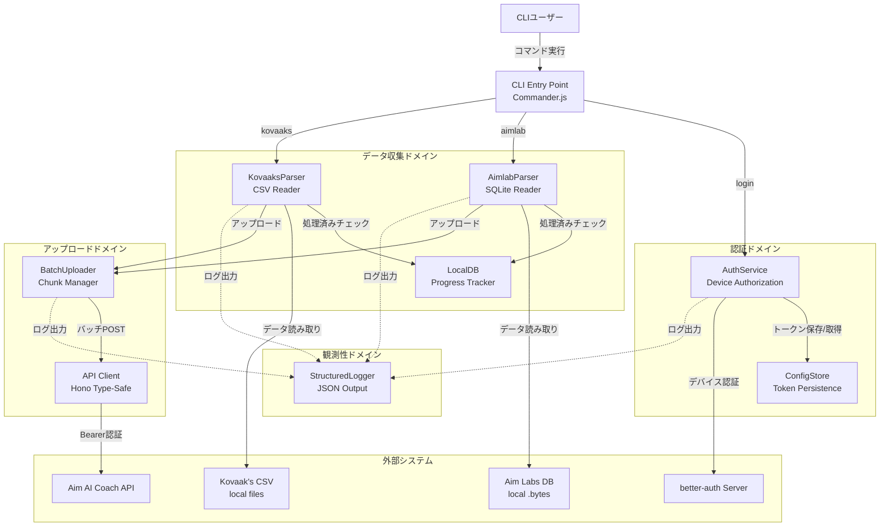
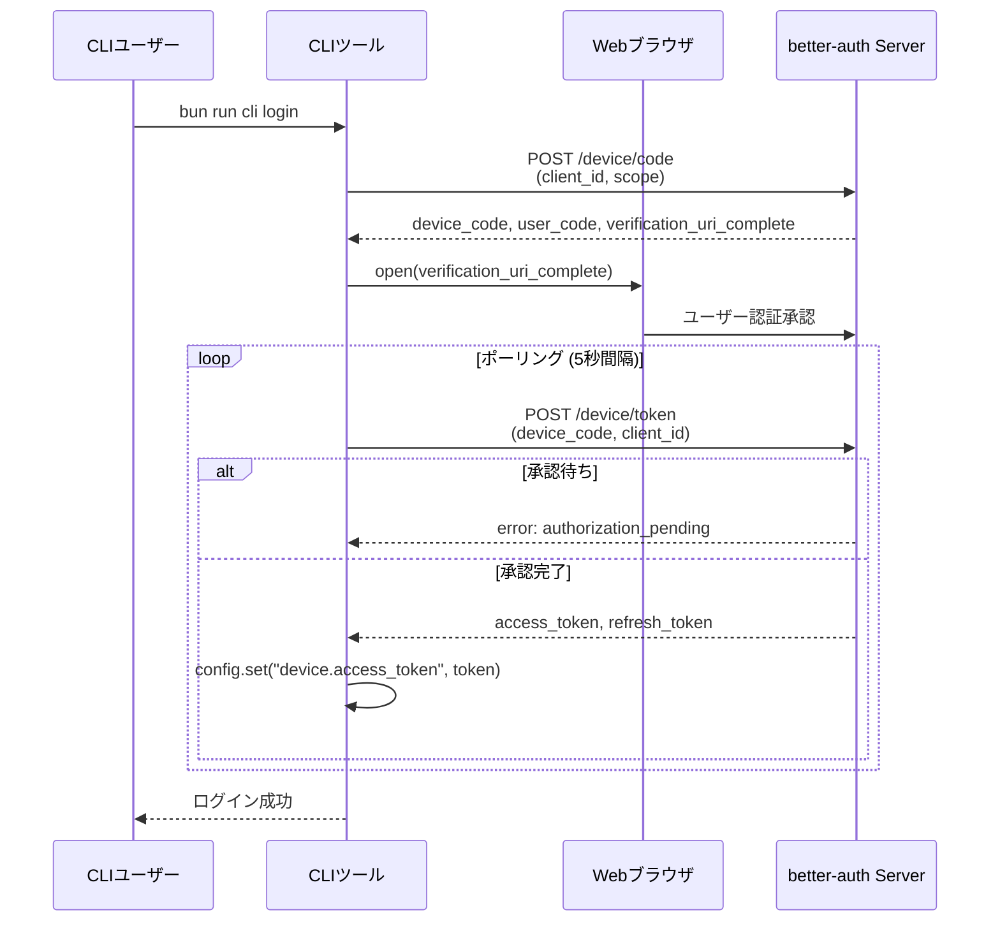
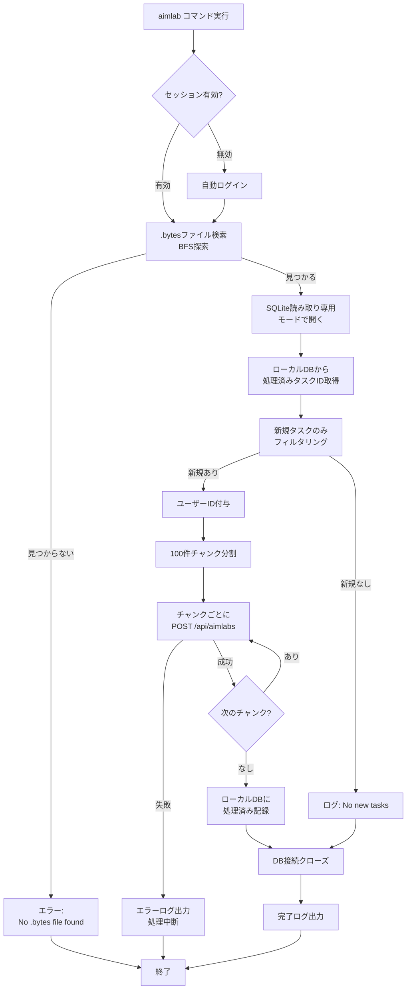
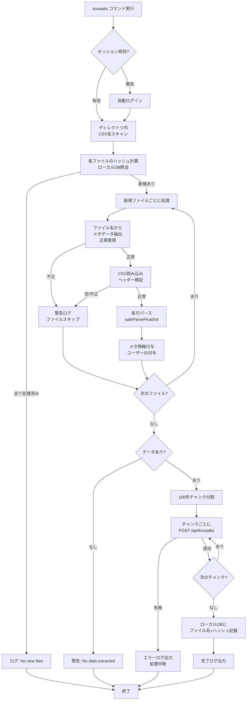

# Technical Design Document: cli-score-collector

## Overview

**Purpose**: 本機能は、Windowsローカル環境で動作するCLIツールとして、Aim LabsとKovaak'sのプレイデータを自動収集してサーバーへアップロードする役割を提供する。既存実装の設計判断とアーキテクチャを文書化し、将来の保守・拡張のための参照資料とする。

**Users**: FPSプレイヤーがローカルPCで定期的に実行し、プレイデータをAim AI Coach バックエンドへ送信する。CLIツールは認証、データパース、増分アップロード、エラーハンドリングを自動化する。

**Impact**: 既存のCLI実装（本番稼働中）を仕様書化することで、以下を実現する:
- 設計判断の根拠を明確化
- 保守性とコラボレーション効率の向上
- 将来の機能拡張時の参照基盤構築

### Goals

- 既存CLI実装のアーキテクチャとインターフェースを文書化
- Device Authorization Flow、データパース、増分アップロードの設計判断を明確化
- コンポーネント間の契約と責任境界を定義
- テスト戦略とエラーハンドリングパターンを文書化

### Non-Goals

- 新規機能の実装（既存実装は全要件を満たす）
- アーキテクチャの大規模リファクタリング
- GUI版CLIツールの設計
- リアルタイム同期機能

---

## Architecture

> 詳細な技術選択とトレードオフは `research.md` を参照

### 既存アーキテクチャ分析

**現行パターン**: Command-Based Layered Architecture
- **CLIレイヤー**: Commander.jsによるコマンドルーティング
- **認証レイヤー**: better-auth Device Authorization Flow統合
- **データ処理レイヤー**: パーサー（Aim Labs, Kovaak's）とローカルDB管理
- **API統合レイヤー**: Hono Client型安全API通信
- **ユーティリティレイヤー**: ログ、ファイル操作、バッチ処理

**既存ドメイン境界**:
- **認証ドメイン**: トークン管理、セッション検証
- **データ収集ドメイン**: ファイル検出、パース、変換
- **アップロードドメイン**: バッチ処理、増分管理、API通信
- **観測性ドメイン**: 構造化ログ、エラー追跡

**統合ポイント**:
- better-auth サーバー (`https://aim-ai-coach.mk2481.dev`)
- Aim AI Coach API (`POST /api/aimlabs`, `POST /api/kovaaks`)
- ローカルファイルシステム（Aim Labs .bytes, Kovaak's CSV）

**技術的負債**: 最小限（コード品質高、型安全性確保済み）

### Architecture Pattern & Boundary Map



**Architecture Integration**:
- **選択パターン**: Command-Based Layered Architecture
- **理由**: CLI用途に最適、テスト容易、コマンド追加が容易
- **ドメイン/機能境界**: 認証、データ収集、アップロード、観測性で明確に分離
- **既存パターン保持**: レイヤー分離、相対インポート、camelCase命名規則
- **新規コンポーネント**: なし（既存実装完全）
- **Steering準拠**: 技術スタック（Bun, TypeScript, Drizzle）に整合

### Technology Stack

#### Runtime & Language
- **Bun 1.0+**: 高速起動、TypeScript直接実行、ネイティブSQLite
- **TypeScript (strict mode)**: 型安全性、コンパイル時エラー検出

#### CLI Framework
- **Commander.js v12+**: コマンドルーティング、オプション解析、ヘルプ生成

#### 認証
- **better-auth client**: Device Authorization Flow標準実装
- **Conf**: クロスプラットフォーム設定ファイル管理（トークン永続化）

#### データ処理
- **bun:sqlite**: ネイティブSQLiteクライアント（Aim Labs .bytes読み取り）
- **Drizzle ORM**: 型安全クエリ、マイグレーション管理
- **Node.js fs/path**: ファイルシステム操作

#### API統合
- **Hono Client**: 型安全API通信（`hc<APIType>`）
- **Fetch API**: HTTPリクエスト（Bun標準）

#### 観測性
- **カスタムLogger**: JSON構造化ログ、ログレベル管理

#### Development
- **Drizzle Kit**: マイグレーション生成・適用
- **TypeScript Compiler**: 型チェック

---

## System Flows

### Device Authorization フロー



### Aim Labs データアップロードフロー



### Kovaak's データアップロードフロー



---

## Requirements Traceability

| 要件 | 要件概要 | コンポーネント | インターフェース | フロー |
|------|---------|--------------|---------------|-------|
| **Req 1** | Device Authorization Flow認証 | `AuthService`, `ConfigStore` | `login()`, `getSessionOrLogin()` | Device Authorization フロー |
| **Req 2** | Aim Labs データパース | `AimlabParser` | `uploadAimlab(path, client, user)` | Aim Labs アップロードフロー |
| **Req 3** | Kovaak's データパース | `KovaaksParser` | `uploadKovaaks(path, client, user)`, `parseKovaaks()` | Kovaak's アップロードフロー |
| **Req 4** | 増分アップロード | `LocalDB` | `getDB()`, `getDbPath()` | 両アップロードフロー（処理済みチェック） |
| **Req 5** | バッチアップロード | `BatchUploader` (util) | `chunkArray<T>(arr, size)` | 両アップロードフロー（チャンク分割） |
| **Req 6** | 構造化ログ | `StructuredLogger` | `logger.info()`, `logger.error()` | 全フロー（観測性） |
| **Req 7** | Commander.js CLI | CLI Entry Point | Commander.jsコマンド定義 | 全フロー（エントリポイント） |
| **Req 8** | エラーハンドリング | 全コンポーネント | try-catch, logger.error() | 全フロー（エラー分岐） |
| **Req 9** | Bunランタイム互換性 | 全コンポーネント | Bun標準API (`bun:sqlite`, `Bun.file()`) | 全フロー（ランタイム） |
| **Req 10** | サーバーAPI統合 | `ApiClient` | `hc<APIType>()`, POST endpoints | 両アップロードフロー（API通信） |

---

## Components and Interfaces

### 認証ドメイン

#### AuthService

**Responsibility & Boundaries**
- **Primary Responsibility**: Device Authorization Flowによる認証とトークン管理
- **Domain Boundary**: 認証ドメイン（他ドメインは認証済みセッションを受け取るのみ）
- **Data Ownership**: アクセストークン、リフレッシュトークン、セッション情報
- **Transaction Boundary**: 単一認証フロー（ポーリング含む）

**Dependencies**
- **Inbound**: CLI Entry Point（コマンド実行時）、データ収集コマンド（セッション確認）
- **Outbound**: better-auth Server（Device Authorization API）、ConfigStore（トークン永続化）
- **External**: better-auth client library, `open` パッケージ（ブラウザ起動）

**Contract Definition**

**Service Interface**:
```typescript
interface AuthService {
  // デバイス認証フローを実行し、セッションを返す
  login(): Promise<Session>;

  // 既存セッション取得、無効時は自動ログイン
  getSessionOrLogin(): Promise<Session>;
}

type Session = {
  user: User;
  session: {
    token: string;
    expiresAt: Date;
  };
};

type User = {
  id: string;
  name: string;
  email: string;
};
```

- **Preconditions**:
  - ブラウザが利用可能
  - ネットワーク接続あり
- **Postconditions**:
  - 有効なアクセストークンがConfigStoreに保存される
  - セッション情報が返される
- **Invariants**:
  - トークンは常に有効期限内または再認証される

#### ConfigStore

**Responsibility & Boundaries**
- **Primary Responsibility**: クロスプラットフォーム設定ファイル管理（トークン永続化）
- **Domain Boundary**: 認証ドメイン（トークン保存専用）
- **Data Ownership**: `device.access_token`, `device.refresh_token`, `device.expires_in`, `device.scope`
- **Transaction Boundary**: 個別キー単位の読み書き

**Dependencies**
- **Inbound**: AuthService（トークン保存/取得）
- **Outbound**: `Conf` ライブラリ（ファイルシステム）
- **External**: Conf library

**Contract Definition**

**Service Interface**:
```typescript
interface ConfigStore {
  get<T>(key: string): T | undefined;
  set<T>(key: string, value: T): void;
}

// 使用例
config.get("device.access_token"); // string | undefined
config.set("device.access_token", "token123");
```

- **Preconditions**: AppDataディレクトリへの書き込み権限
- **Postconditions**: 設定が永続化される
- **Invariants**: クロスプラットフォーム互換性（macOS/Windows/Linux）

---

### データ収集ドメイン

#### AimlabParser

**Responsibility & Boundaries**
- **Primary Responsibility**: Aim Labs SQLiteデータベースからタスクデータを抽出し、アップロード可能形式に変換
- **Domain Boundary**: Aim Labs データ処理（Kovaak'sとは独立）
- **Data Ownership**: Aim Labsタスクデータ（一時的）
- **Transaction Boundary**: 単一アップロード処理（新規タスクフィルタリング → アップロード → 処理済み記録）

**Dependencies**
- **Inbound**: CLI Entry Point（aimlabコマンド）
- **Outbound**: LocalDB（処理済みタスクID取得/保存）、BatchUploader（チャンクアップロード）、ApiClient（API通信）
- **External**: `bun:sqlite`, Drizzle ORM, Aim Labs .bytesファイル

**Contract Definition**

**Service Interface**:
```typescript
interface AimlabParser {
  // Aim Labsデータをパースしてアップロード
  uploadAimlab(
    path: string,
    apiClient: ClientType,
    user: User
  ): Promise<void>;
}

type ClientType = ReturnType<typeof hc<APIType>>;

type User = {
  id: string;
  name: string;
  email: string;
};
```

- **Preconditions**:
  - 指定パスに.bytesファイルが存在
  - 有効な認証セッション
- **Postconditions**:
  - 新規タスクデータがサーバーにアップロードされる
  - 処理済みタスクIDがLocalDBに記録される
- **Invariants**:
  - SQLite接続は読み取り専用
  - 処理済みタスクは再アップロードされない

#### KovaaksParser

**Responsibility & Boundaries**
- **Primary Responsibility**: Kovaak's CSVファイルからスコアデータを抽出し、アップロード可能形式に変換
- **Domain Boundary**: Kovaak's データ処理（Aim Labsとは独立）
- **Data Ownership**: Kovaak's スコアデータ（一時的）
- **Transaction Boundary**: 単一アップロード処理（新規ファイルフィルタリング → パース → アップロード → 処理済み記録）

**Dependencies**
- **Inbound**: CLI Entry Point（kovaaksコマンド）
- **Outbound**: LocalDB（処理済みファイル取得/保存）、BatchUploader（チャンクアップロード）、ApiClient（API通信）
- **External**: Node.js fs, Kovaak's CSVファイル

**Contract Definition**

**Service Interface**:
```typescript
interface KovaaksParser {
  // Kovaak's データをパースしてアップロード
  uploadKovaaks(
    path: string,
    client: ClientType,
    user: User
  ): Promise<void>;

  // 内部: CSVファイルをパース
  parseKovaaks(
    path: string,
    file: string,
    user: User
  ): Promise<KovaaksData[] | null>;

  // 内部: ファイル名からメタデータ抽出
  parseFilename(path: string): MetaData | null;
}

type MetaData = {
  scenarioName: string;
  mode: string;
  runDatetimeText: string;
  runEpochSec: number;
  sourceFilename: string;
};

type KovaaksData = {
  userId: string;
  scenarioName: string;
  mode: string;
  runDatetimeText: string;
  runEpochSec: number;
  sourceFilename: string;
  accuracy: number;
  bot: string;
  cheated: number;
  damageDone: number;
  damagePossible: number;
  efficiency: number;
  hits: number;
  killNumber: number;
  overShots: number;
  shots: number;
  ttk: string;
  timestamp: string;
  weapon: string;
};
```

- **Preconditions**:
  - 指定ディレクトリにCSVファイルが存在
  - 有効な認証セッション
- **Postconditions**:
  - 新規CSVファイルのデータがサーバーにアップロードされる
  - 処理済みファイル名+ハッシュがLocalDBに記録される
- **Invariants**:
  - 不正ファイル名/CSVはスキップされる
  - 数値変換エラー時はデフォルト値（0）使用

#### LocalDB

**Responsibility & Boundaries**
- **Primary Responsibility**: 処理済みファイル追跡のためのローカルSQLiteデータベース管理
- **Domain Boundary**: 増分アップロード管理（認証・パース・API通信とは独立）
- **Data Ownership**: `localCompleteKovaaksScore`, `localCompleteAimlabTask`テーブル
- **Transaction Boundary**: 個別レコード挿入（`onConflictDoNothing`）

**Dependencies**
- **Inbound**: AimlabParser、KovaaksParser（処理済みチェック/記録）
- **Outbound**: Drizzle ORM、SQLiteファイル（AppData）
- **External**: `bun:sqlite`, Drizzle ORM

**Contract Definition**

**Service Interface**:
```typescript
interface LocalDB {
  // ローカルDBインスタンス取得（初回実行時はマイグレーション）
  getDB(): Promise<DrizzleDB>;

  // DBパス取得（クロスプラットフォーム）
  getDbPath(): Promise<string>;
}

type DrizzleDB = ReturnType<typeof drizzle>;
```

**Data Model**:
```typescript
// Kovaak's 処理済み追跡
const localCompleteKovaaksScore = sqliteTable(
  "local_complete_kovaaks_score",
  {
    fileName: text("file_name").primaryKey(),
    fileHash: text("file_hash").notNull(),
  }
);

// Aim Labs 処理済み追跡
const localCompleteAimlabTask = sqliteTable(
  "local_complete_aimlab_task",
  {
    taskId: integer("task_id").primaryKey(),
  }
);
```

- **Preconditions**: AppDataディレクトリへの書き込み権限
- **Postconditions**:
  - 初回実行時にDBファイルとテーブルが作成される
  - マイグレーション適用済み
- **Invariants**:
  - クロスプラットフォーム互換（macOS: `~/Library/Application Support`, Windows: `%APPDATA%`, Linux: `~/.local/share`）
  - 競合時は既存レコード保持（`onConflictDoNothing`）

---

### アップロードドメイン

#### BatchUploader (Utility)

**Responsibility & Boundaries**
- **Primary Responsibility**: データを100件チャンクに分割し、順次アップロード管理
- **Domain Boundary**: バッチ処理ユーティリティ（データソース非依存）
- **Data Ownership**: なし（データ変換のみ）
- **Transaction Boundary**: チャンク単位（失敗時は処理中断）

**Dependencies**
- **Inbound**: AimlabParser、KovaaksParser（チャンク分割要求）
- **Outbound**: なし（純粋関数）
- **External**: なし

**Contract Definition**

**Service Interface**:
```typescript
interface BatchUploader {
  // 配列を指定サイズでチャンク分割
  chunkArray<T>(arr: T[], size: number): T[][];
}
```

- **Preconditions**: `size > 0`
- **Postconditions**: 元配列が指定サイズのチャンク配列に分割される
- **Invariants**:
  - 元配列の順序保持
  - 最後のチャンクはsize以下

#### ApiClient

**Responsibility & Boundaries**
- **Primary Responsibility**: 型安全なAPI通信（Hono Client）
- **Domain Boundary**: API統合（認証ヘッダー設定、エラーハンドリング）
- **Data Ownership**: なし（通信のみ）
- **Transaction Boundary**: 個別HTTPリクエスト

**Dependencies**
- **Inbound**: AimlabParser、KovaaksParser（アップロードリクエスト）
- **Outbound**: Aim AI Coach API（`POST /api/aimlabs`, `POST /api/kovaaks`）
- **External**: Hono Client, Fetch API

**Contract Definition**

**API Contract**:

| Method | Endpoint | Request | Response | Errors |
|--------|----------|---------|----------|--------|
| POST | /api/aimlabs | `AimlabTask[]` | `{success: boolean, count: number}` | 400, 401, 500 |
| POST | /api/kovaaks | `KovaaksData[]` | `{success: boolean, count: number}` | 400, 401, 500 |

**Request Headers**:
```
Authorization: Bearer <access_token>
Content-Type: application/json
```

**Response Schema**:
```typescript
type UploadResponse = {
  success: boolean;
  count: number;
};
```

- **Preconditions**:
  - 有効なBearer トークン
  - リクエストボディがJSON配列
- **Postconditions**:
  - 成功時: データがサーバーDBに保存される
  - 失敗時: エラーレスポンスとログ記録
- **Invariants**:
  - 型安全性（`hc<APIType>`による型推論）
  - エラーレスポンスはテキストでログ記録

---

### 観測性ドメイン

#### StructuredLogger

**Responsibility & Boundaries**
- **Primary Responsibility**: JSON構造化ログ出力とログレベル管理
- **Domain Boundary**: 観測性（全ドメインがログを依存）
- **Data Ownership**: ログエントリ（一時的、標準出力へ出力）
- **Transaction Boundary**: 個別ログ出力（即座に標準出力）

**Dependencies**
- **Inbound**: 全コンポーネント（ログ出力要求）
- **Outbound**: console（標準出力）
- **External**: なし

**Contract Definition**

**Service Interface**:
```typescript
interface StructuredLogger {
  debug(message: string, data?: Record<string, unknown>): void;
  info(message: string, data?: Record<string, unknown>): void;
  warn(message: string, data?: Record<string, unknown>): void;
  error(message: string, error?: unknown): void;
  setLevel(level: LogLevel): void;
}

enum LogLevel {
  DEBUG = 0,
  INFO = 1,
  WARN = 2,
  ERROR = 3,
}

type LogEntry = {
  timestamp: string;  // ISO 8601
  level: 'DEBUG' | 'INFO' | 'WARN' | 'ERROR';
  message: string;
  data?: Record<string, unknown>;
};
```

**Output Format**:
```json
{
  "timestamp": "2025-11-11T15:45:00.000Z",
  "level": "INFO",
  "message": "Starting Aimlab data upload",
  "data": {
    "path": "/path/to/aimlab",
    "userId": "user123"
  }
}
```

- **Preconditions**: なし
- **Postconditions**:
  - ログエントリがJSON形式で標準出力に書き込まれる
  - エラー時はスタックトレースが自動抽出される
- **Invariants**:
  - ログレベル閾値未満のログは出力されない
  - 環境変数（`NODE_ENV=development`）でDEBUGレベル自動有効化

---

## Data Models

### Logical Data Model

#### ローカルDB（処理済み追跡）

**Kovaak's 処理済みファイル追跡**:
- **エンティティ**: `localCompleteKovaaksScore`
- **属性**:
  - `fileName` (text, PK): ファイル名
  - `fileHash` (text, NOT NULL): SHA-256ハッシュ
- **ビジネスルール**:
  - ファイル名+ハッシュの組み合わせで重複チェック
  - 同一ファイル名でも内容変更時は再アップロード

**Aim Labs 処理済みタスク追跡**:
- **エンティティ**: `localCompleteAimlabTask`
- **属性**:
  - `taskId` (integer, PK): タスクID
- **ビジネスルール**:
  - タスクIDの一意性で重複防止

#### サーバーDB（アップロードデータ）

**Aim Labs タスクデータ**:
- **テーブル**: `aimlabTaskTable`
- **主要属性**: `taskId`, `userId`, `startedAt`, `score`, ...
- **参照**: サーバー側スキーマ（`api/mastra/db/schema.ts`）

**Kovaak's スコアデータ**:
- **テーブル**: `kovaaksScoresTable`
- **主要属性**: `userId`, `scenarioName`, `mode`, `runEpochSec`, `accuracy`, `hits`, `shots`, ...
- **参照**: サーバー側スキーマ（`api/mastra/db/schema.ts`）

### Data Contracts & Integration

**Aim Labs アップロードペイロード**:
```typescript
type AimlabTask = {
  taskId: number;
  userId: string;
  startedAt: string;
  // ... 他のフィールド（Aim Labs スキーマ準拠）
};

// POST /api/aimlabs
Request: AimlabTask[]
Response: { success: boolean, count: number }
```

**Kovaak's アップロードペイロード**:
```typescript
type KovaaksData = {
  userId: string;
  scenarioName: string;
  mode: string;
  runDatetimeText: string;
  runEpochSec: number;
  sourceFilename: string;
  accuracy: number;
  hits: number;
  shots: number;
  // ... 他のスコアフィールド
};

// POST /api/kovaaks
Request: KovaaksData[]
Response: { success: boolean, count: number }
```

**Serialization Format**: JSON (Content-Type: application/json)

---

## Error Handling

### Error Strategy

**階層的エラーハンドリング**:
1. **ファイルレベル**: 不正ファイルは警告ログでスキップ（処理継続）
2. **パースレベル**: 数値変換エラーはデフォルト値（0）使用（処理継続）
3. **アップロードレベル**: チャンク失敗時は即座に処理中断（ロールバック明確化）
4. **認証レベル**: トークン無効時は再認証促進（ユーザーアクション必要）

### Error Categories and Responses

**User Errors (CLI実行エラー)**:
- **ファイル不在**: `No .bytes file found in the specified path` → パス確認を促す
- **認証失敗**: トークン無効 → 再認証促進（`login`コマンド実行）
- **不正ファイル名**: 警告ログ + スキップ → 影響なし（他ファイル処理継続）

**System Errors (インフラ/ネットワーク)**:
- **ネットワークエラー**: エラーログ + 処理中断 → 次回実行時に再試行（増分管理により重複なし）
- **SQLite接続エラー**: エラーログ + 処理中断 → ファイル権限確認を促す
- **API 5xxエラー**: エラーログ + レスポンスボディ記録 → サーバー側調査

**Business Logic Errors**:
- **CSV列数不一致**: デバッグログ + 行スキップ → 処理継続
- **数値変換エラー**: デフォルト値（0）使用 + ログ記録 → 処理継続
- **日時パース失敗**: 警告ログ + ファイルスキップ → 処理継続

### Monitoring

**構造化ログによる観測性**:
- **INFO**: 処理開始/完了、進捗（チャンク数、ファイル数）
- **WARN**: 不正ファイル、パース失敗（スキップ）
- **ERROR**: ネットワークエラー、API失敗、認証失敗
- **DEBUG**: 詳細パース情報、ファイルハッシュ計算

**ログ解析**:
```bash
# エラーのみフィルタリング
bun run cli aimlab /path | jq 'select(.level == "ERROR")'

# アップロード成功件数集計
bun run cli kovaaks /path | jq -r '.data.recordsUploaded'
```

---

## Testing Strategy

### Unit Tests

**Core Functions**:
1. **chunkArray()**: 配列分割ロジック（境界値: 0件、1件、100件、101件）
2. **parseFilename()**: 正規表現マッチング（正常、不正、境界ケース）
3. **safeParseFloat/Int()**: 数値変換（正常、空文字、NaN、デフォルト値）
4. **hashFile()**: ファイルハッシュ計算（同一ファイル、異なるファイル、大容量ファイル）
5. **Logger.processError()**: エラー構造化（Error, オブジェクト、文字列、null/undefined）

### Integration Tests

**Cross-Component Flows**:
1. **Device Authorization Flow**: 認証サーバーモック → トークン保存 → ConfigStore確認
2. **Aim Labs パース**: モック.bytesファイル → SQLiteクエリ → データ抽出検証
3. **Kovaak's パース**: モックCSVファイル → 正規表現 → データ抽出検証
4. **LocalDB 増分管理**: 処理済み記録 → 重複チェック → スキップ確認
5. **API統合**: モックサーバー → チャンクアップロード → レスポンス検証

### E2E Tests

**Critical User Paths**:
1. **初回認証 → Aim Labsアップロード**: ログイン → ファイル検出 → アップロード → 完了ログ
2. **既存セッション → Kovaak's アップロード**: セッション再利用 → CSVスキャン → アップロード → 完了ログ
3. **増分アップロード**: 初回アップロード → 2回目実行 → 新規ファイルのみアップロード確認
4. **エラーリカバリ**: ネットワーク切断 → エラーログ → 再実行 → 正常完了
5. **不正データハンドリング**: 不正CSV → 警告ログ + スキップ → 他ファイル正常処理

---

## Optional Sections

### Security Considerations

**認証セキュリティ**:
- **Device Authorization Flow**: OAuth 2.0標準（RFC 8628）準拠、ブラウザ認証でパスワード露出なし
- **トークン保存**: Confライブラリによるクロスプラットフォーム安全保存（権限制御）
- **Bearer 認証**: HTTPヘッダーでトークン送信、TLS必須（本番環境）

**データ保護**:
- **読み取り専用アクセス**: Aim Labs .bytesファイルは読み取り専用モードで開く（データ破損防止）
- **ローカルDB**: AppDataディレクトリで保護（ユーザー権限内）

**リスク**:
- **トークン漏洩**: ConfigStore設定ファイルへのアクセス権限に依存（OS標準保護）
- **ネットワーク傍受**: TLS必須（本番環境では`baseURL: https://...`）

### Performance & Scalability

**Target Metrics**:
- **起動時間**: < 1秒（Bunランタイム最適化）
- **SQLite読み取り**: < 500ms / 1000タスク（bun:sqlite最適化）
- **CSVパース**: < 1秒 / 100ファイル（並列ファイル処理なし、順次処理で十分）
- **アップロード**: < 30秒 / 100件チャンク（ネットワーク依存）

**Scaling Approaches**:
- **データ量増加**: チャンク分割により線形スケール（メモリ使用量一定）
- **ファイル数増加**: 順次処理で安定（並列化は将来検討）
- **ネットワーク最適化**: チャンクサイズ調整可能（現行100件）

**Caching Strategies**:
- **ローカルDB**: 処理済みファイル追跡によりネットワーク削減
- **ファイルハッシュ**: 同一ファイル名でも内容変更検出（キャッシュ無効化）

---

## Migration Strategy

本機能は既存実装の仕様書化であり、マイグレーション不要。

---

**設計書バージョン**: 1.0
**最終更新**: 2025-11-11
**ステータス**: 設計完了、タスク生成待ち
