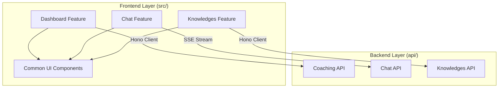
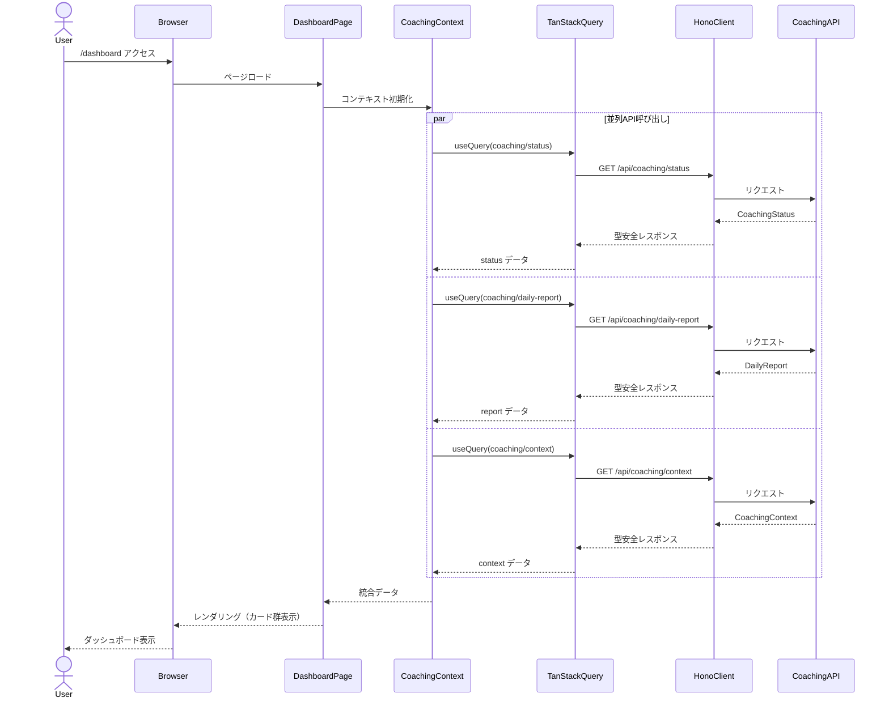
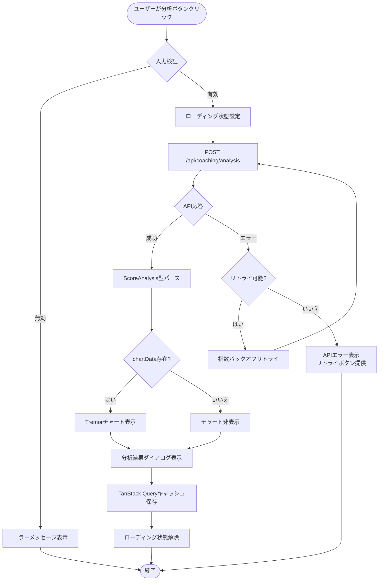
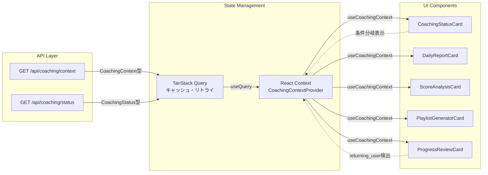
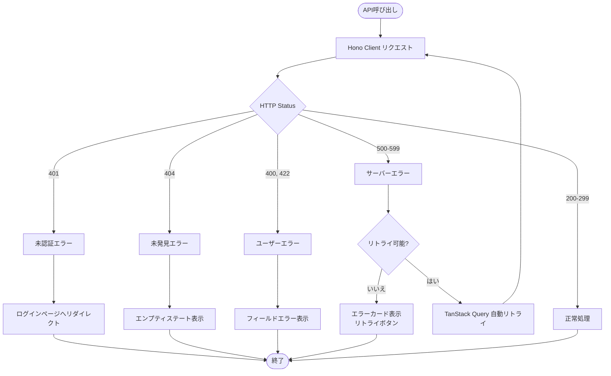

# 技術設計書: coaching-dashboard-ui

## 概要

本機能は、既存のコーチングバックエンドAPI群（10種類のエンドポイント）を統合した包括的ダッシュボードUIを提供する。FPSプレイヤーに対してデータドリブンなコーチング体験をビジュアルに提示し、既存チャット機能（AimAssistant）とシームレスに統合する。

**目的**: aim-coach-ai-agent 仕様で実装されたLangGraphベースのコーチングシステムを、ユーザーが直感的に操作できるダッシュボードUIとして実現する。

**対象ユーザー**: FPSプレイヤー（初心者〜上級者）。コーチングステータス、デイリーレポート、スコア分析、プレイリスト生成、振り返りレビューを統合的に利用する。

**影響**: 現在のシンプルなチャットUI（`/`）を維持しつつ、新規ダッシュボードページ（`/dashboard`）を追加。既存システムへの影響を最小化しながら、包括的なコーチング機能へのアクセスを提供する。

### ゴール

- 既存10種類のコーチングAPIエンドポイントを完全統合
- スマートフォン・PC両対応のレスポンシブUI実装
- WCAG AA準拠のアクセシブルなダッシュボード提供
- TanStack Query によるパフォーマンス最適化（並列クエリ、キャッシング、自動リトライ）
- 既存チャット機能とのシームレスな統合

### 非ゴール

- バックエンドAPIエンドポイントの新規作成（既存10種類を利用）
- LangGraphコーチングロジックの変更
- 既存チャット機能（AimAssistant）の改修
- 管理画面・分析ツール等の別機能追加

## アーキテクチャ

> 詳細な発見ノートは `research.md` を参照。本ドキュメントはアーキテクチャ境界と明示的契約に焦点を当てる。

### 既存アーキテクチャ分析

**現状のアーキテクチャパターン**:
- **フロントエンド**: TanStack Start SSR + React 19 + TanStack Router（File-based routing）
- **バックエンド**: Hono + LangGraph + Mastra
- **分離方針**: `src/`（フロントエンド）と `api/`（バックエンド）の明確な責任分離
- **認証**: Better Auth（Passkey、Magic Link対応）、`requireUser` middleware

**既存ドメイン境界**:
- **チャットドメイン**: `/` ルート、`AimAssistant` コンポーネント、`POST /api/chat` エンドポイント
- **コーチングドメイン**: `api/routes/coaching.ts` の10種類のエンドポイント（未統合）
- **ナレッジドメイン**: `/knowledges` ルート、RAG機能

**維持すべき統合ポイント**:
- Hono Client による型安全API通信（`src/lib/client.ts`）
- TanStack Query によるサーバー状態管理（`src/routes/__root.tsx:67`）
- Radix UI Themes による統一UIスタイル（`src/routes/__root.tsx:75`）
- Better Auth による認証基盤

**対処または回避する技術的負債**:
- **現状**: 10種類のコーチングAPIエンドポイントが未統合（現在は `/api/chat` のみ使用）
- **対処**: 新規ダッシュボードページで完全統合、既存チャット機能を維持しながら段階的に拡張

### アーキテクチャパターンと境界マップ

**選択したパターン**: **Layered Architecture + Feature-based Organization**

**理由**:
- 既存システムのLayered Architecture（フロントエンド層、バックエンド層）を継承
- ダッシュボード機能をFeature単位で整理（`src/components/dashboard/`、`src/routes/dashboard/`）
- 責任分離を維持し、保守性向上

**ドメイン・機能境界**:


**責任分離の根拠**:
- **Dashboard Feature**: コーチングステータス、レポート、分析、プレイリスト、レビューの統合表示
- **Chat Feature**: 既存のAimAssistant、対話的コーチング
- **Common UI Components**: 再利用可能なUIプリミティブ（Card、Button、Dialog等）
- **Coaching API**: LangGraph コーチングロジック、10種類のエンドポイント

**新規コンポーネントの根拠**:
- `DashboardPage`: ダッシュボードレイアウト、カード群の配置、レスポンシブ対応
- `CoachingStatusCard`: ステータス表示専用、Requirement 1 対応
- `DailyReportCard`: デイリーレポート表示専用、Requirement 2 対応
- `ScoreAnalysisCard`: 分析実行・結果表示専用、Requirement 3 対応
- `PlaylistGeneratorCard`: プレイリスト生成フォーム・結果表示専用、Requirement 4 対応
- `ProgressReviewCard`: 振り返りレビュー表示専用、Requirement 5 対応
- `CoachingContextProvider`: グローバルコンテキスト管理、Requirement 7 対応

**既存パターンの保持**:
- File-based routing: `src/routes/dashboard/index.tsx` を新規作成
- Absolute imports: `@/` による絶対パスインポート
- Radix UI Themes + Tailwind CSS v4 によるスタイリング
- TanStack Query による API 状態管理

**Steering 準拠**:
- Frontend-Backend 分離の維持（`src/` vs `api/`）
- PascalCase コンポーネント命名（`DashboardPage.tsx`）
- Feature-first organization（`src/components/dashboard/`）

### 技術スタック

#### フロントエンド層

| 技術 | バージョン | 役割 | 備考 |
|------|----------|------|------|
| **React** | 19.2.0 | UIフレームワーク | 既存スタック、Server Components対応 |
| **TanStack Start** | 1.134.0 | SSRフレームワーク | 既存スタック、ルーティング・SSR統合 |
| **TanStack Router** | 1.133.36 | ルーティング | File-based routing、既存パターン踏襲 |
| **TanStack Query** | 5.90.5 | サーバー状態管理 | 並列クエリ、キャッシング、自動リトライ |
| **Radix UI Themes** | 3.2.1 | UIコンポーネントライブラリ | 既存スタック、アクセシビリティ標準準拠 |
| **Tailwind CSS** | 4.1.16 | スタイリング | 既存スタック、レスポンシブユーティリティ |
| **TypeScript** | 5.9.3 | 型安全性 | strict mode、既存スタック |

**新規導入ライブラリ**:

| ライブラリ | バージョン | 役割 | 導入根拠 |
|----------|----------|------|---------|
| **Tremor** | 最新安定版 | チャート・ダッシュボードコンポーネント | Recharts + Radix UI ベース、既存スタック統合、WCAG AA準拠（詳細: `research.md`） |
| **react-day-picker** | 8.10.1 | 日付選択（Tremor Date Picker依存） | TypeScript対応、date-fns統合、Radix UI Popover連携（詳細: `research.md`） |
| **date-fns** | 最新安定版 | 日付操作 | react-day-picker依存、軽量、国際化対応 |

#### バックエンド層（既存、変更なし）

| 技術 | バージョン | 役割 |
|------|----------|------|
| **Hono** | 4.10.4 | APIルーティング・middleware |
| **LangGraph** | 1.0.1 | AIコーチング・オーケストレーション |
| **Google Gemini** | gemini-2.0-flash-exp | LLMモデル |
| **LibSQL (Turso)** | 0.15.15 | データベース |
| **Drizzle ORM** | 0.44.7 | 型安全データベースクエリ |

#### 統合・横断技術

| 技術 | バージョン | 役割 |
|------|----------|------|
| **Hono Client** | hono/client | 型安全API通信（`src/lib/client.ts`） |
| **Better Auth** | 1.3.34 | 認証・認可（既存） |
| **Zod** | 4.1.12 | ランタイムバリデーション（オプション） |

**アーキテクチャパターン選択**:
- **選択**: Layered Architecture + Feature-based Organization
- **理由**: 既存システムとの統合性、保守性、段階的拡張性

## システムフロー

### シーケンス図: ダッシュボード初期ロード



### プロセスフロー: スコア分析実行



### データフロー: コンテキスト管理



## 要件トレーサビリティ

| 要件 | 要件概要 | コンポーネント | インターフェース | フロー |
|------|---------|--------------|--------------|-------|
| 1 | コーチングステータス表示 | `CoachingStatusCard`, `useCoachingStatus` | `GET /api/coaching/status` → `CoachingStatus` | ダッシュボード初期ロード |
| 2 | デイリーレポート表示 | `DailyReportCard`, `useDailyReport`, `DatePicker` | `GET /api/coaching/daily-report` → `DailyReport` | ダッシュボード初期ロード |
| 3 | スコア分析実行と結果表示 | `ScoreAnalysisCard`, `AnalysisDialog`, `TremorChart` | `POST /api/coaching/analysis` → `ScoreAnalysis` | スコア分析実行フロー |
| 4 | プレイリスト生成フォームと結果表示 | `PlaylistGeneratorCard`, `PlaylistDialog` | `POST /api/coaching/playlist` → `Playlist` | プレイリスト生成フロー |
| 5 | 振り返りレビュー表示 | `ProgressReviewCard`, `ProgressBar` | `GET /api/coaching/progress/review` → `ProgressReport` | コンテキスト管理フロー |
| 6 | 既存チャット機能との統合 | `ChatModal`, `AimAssistant` | `/api/chat` SSE Stream | チャットモーダルフロー |
| 7 | コーチングコンテキスト管理 | `CoachingContextProvider`, `useCoachingContext` | `GET /api/coaching/context` → `CoachingContext` | コンテキスト管理フロー |
| 8 | レスポンシブレイアウトとアクセシビリティ | `DashboardLayout`, Radix UI Themes Grid | Radix UI アクセシビリティ機能 | - |
| 9 | 型安全なAPI通信 | `client.ts`, Hono Client | `hc<APIType>` 型推論 | 全フロー |
| 10 | パフォーマンスとローディング状態管理 | TanStack Query, `Skeleton`, `React.lazy` | useQuery並列クエリ、キャッシング | ダッシュボード初期ロード |

## コンポーネントとインターフェース

### プレゼンテーション層（UI Components）

#### DashboardPage

**責任と境界**:
- **主要責任**: ダッシュボードページ全体のレイアウト、カード群の配置、レスポンシブ対応
- **ドメイン境界**: Dashboard Feature
- **データ所有権**: なし（子コンポーネントが個別にデータ管理）
- **トランザクション境界**: 適用外

**依存関係**:
- **Inbound**: TanStack Router（`/dashboard` ルート）
- **Outbound**: `CoachingStatusCard`, `DailyReportCard`, `ScoreAnalysisCard`, `PlaylistGeneratorCard`, `ProgressReviewCard`, `ChatModal`
- **External**: Radix UI Themes（Container、Grid、Flex）

**契約定義**:

**UI契約**（Reactコンポーネント）:
```typescript
interface DashboardPageProps {
  userId: string; // 認証済みユーザーID（AuthLayout経由）
}

export function DashboardPage({ userId }: DashboardPageProps): JSX.Element;
```

- **前提条件**: ユーザーが認証済み（Better Auth）
- **事後条件**: レスポンシブグリッドレイアウトでカード群を表示、Skeleton表示対応
- **不変条件**: userId が有効な文字列

**状態管理**:
- **状態モデル**: ローカル状態なし（CoachingContextProvider経由でグローバル状態アクセス）
- **永続化**: 適用外
- **並行性**: 適用外

#### CoachingStatusCard

**責任と境界**:
- **主要責任**: コーチングステータス表示（ユーザーコンテキスト、推奨練習、トレンドサマリー）、Requirement 1 対応
- **ドメイン境界**: Dashboard Feature
- **データ所有権**: `GET /api/coaching/status` レスポンスの表示ロジック
- **トランザクション境界**: 適用外

**依存関係**:
- **Inbound**: `DashboardPage`
- **Outbound**: `useCoachingStatus` カスタムフック、`Badge`、`Card`、`Flex`、lucide-react アイコン
- **External**: TanStack Query（`useQuery`）、Hono Client

**契約定義**:

**UI契約**（Reactコンポーネント）:
```typescript
interface CoachingStatusCardProps {
  userId: string;
}

export function CoachingStatusCard({ userId }: CoachingStatusCardProps): JSX.Element;
```

**カスタムフック契約**:
```typescript
interface UseCoachingStatusResult {
  status: CoachingStatus | undefined;
  isLoading: boolean;
  isError: boolean;
  error: Error | null;
  refetch: () => void;
}

function useCoachingStatus(userId: string): UseCoachingStatusResult;
```

**API契約**（既存、変更なし）:
| Method | Endpoint | Request | Response | Errors |
|--------|----------|---------|----------|--------|
| GET | /api/coaching/status | Query: `userId` | `CoachingStatus` | 401, 404, 500 |

**CoachingStatus型**（既存、`api/langgraph/types.ts:213-234`）:
```typescript
interface CoachingStatus {
  userContext: UserContext; // "new_user" | "returning_user" | "active_user" | "playlist_recommended" | "analysis_recommended"
  todayFocus: {
    focusSkills: string[];
    recommendedDuration: number;
    recommendedScenarios: string[];
  } | null;
  scoreTrendSummary: {
    trend: "improving" | "stable" | "declining";
    improvedSkills: string[];
    challengeSkills: string[];
  } | null;
  activePlaylist: {
    id: string;
    title: string;
    scenariosCount: number;
  } | null;
  latestReport: {
    date: Date;
    generatedAt: Date;
  } | null;
}
```

- **前提条件**: userId が有効、認証済み
- **事後条件**: CoachingStatus データを Card 形式で表示、エラー時はリトライボタン表示
- **不変条件**: userContext は常に有効な UserContext 型

#### DailyReportCard

**責任と境界**:
- **主要責任**: デイリーレポート表示（セッション数、パフォーマンス評価、達成事項、推奨練習）、Requirement 2 対応
- **ドメイン境界**: Dashboard Feature
- **データ所有権**: `GET /api/coaching/daily-report` レスポンスの表示ロジック
- **トランザクション境界**: 適用外

**依存関係**:
- **Inbound**: `DashboardPage`
- **Outbound**: `useDailyReport` カスタムフック、`DatePicker`（Tremor）、`Card`、`Badge`
- **External**: TanStack Query（`useQuery`）、Hono Client、Tremor Date Picker

**契約定義**:

**UI契約**（Reactコンポーネント）:
```typescript
interface DailyReportCardProps {
  userId: string;
}

export function DailyReportCard({ userId }: DailyReportCardProps): JSX.Element;
```

**カスタムフック契約**:
```typescript
interface UseDailyReportResult {
  report: DailyReport | undefined;
  isLoading: boolean;
  isError: boolean;
  error: Error | null;
  refetch: (date?: Date) => void; // 日付指定でレポート再取得
}

function useDailyReport(userId: string, date?: Date): UseDailyReportResult;
```

**API契約**（既存、変更なし）:
| Method | Endpoint | Request | Response | Errors |
|--------|----------|---------|----------|--------|
| GET | /api/coaching/daily-report | Query: `userId`, `date?` | `DailyReport` | 401, 404, 500 |

**DailyReport型**（既存、`api/langgraph/types.ts:139-154`）:
```typescript
interface DailyReport {
  id: string;
  userId: string;
  date: Date;
  sessionsCount: number;
  totalDuration: number;
  performanceRating: "good" | "normal" | "needs_improvement";
  achievements: string[];
  challenges: string[];
  tomorrowRecommendations: {
    focusSkills: string[];
    recommendedScenarios: string[];
    recommendedDuration: number;
  };
  createdAt: Date;
}
```

- **前提条件**: userId が有効、認証済み
- **事後条件**: DailyReport データを Card 形式で表示、日付選択で動的更新、エラー時はリトライボタン
- **不変条件**: performanceRating は常に有効な評価値

#### ScoreAnalysisCard

**責任と境界**:
- **主要責任**: スコア分析実行ボタン提供、分析結果表示（トレンド、強み、弱点、チャート）、Requirement 3 対応
- **ドメイン境界**: Dashboard Feature
- **データ所有権**: `POST /api/coaching/analysis` リクエスト・レスポンスのロジック
- **トランザクション境界**: 適用外

**依存関係**:
- **Inbound**: `DashboardPage`
- **Outbound**: `useScoreAnalysis` カスタムフック、`AnalysisDialog`、`TremorChart`、`Button`
- **External**: TanStack Query（`useMutation`）、Hono Client、Tremor Charts

**契約定義**:

**UI契約**（Reactコンポーネント）:
```typescript
interface ScoreAnalysisCardProps {
  userId: string;
}

export function ScoreAnalysisCard({ userId }: ScoreAnalysisCardProps): JSX.Element;
```

**カスタムフック契約**:
```typescript
interface UseScoreAnalysisResult {
  analysis: ScoreAnalysis | undefined;
  isLoading: boolean;
  isError: boolean;
  error: Error | null;
  executeAnalysis: () => void;
  cancelAnalysis: () => void; // TanStack Query cancellation
}

function useScoreAnalysis(userId: string): UseScoreAnalysisResult;
```

**API契約**（既存、変更なし）:
| Method | Endpoint | Request | Response | Errors |
|--------|----------|---------|----------|--------|
| POST | /api/coaching/analysis | JSON: `{ userId: string }` | `ScoreAnalysis` | 401, 500 |

**ScoreAnalysis型**（既存、`api/langgraph/types.ts:159-174`）:
```typescript
interface ScoreAnalysis {
  userId: string;
  period: { start: Date; end: Date };
  trend: "improving" | "stable" | "declining";
  strengths: string[];
  challenges: string[];
  milestones: string[];
  chartData: {
    labels: string[];
    datasets: Array<{
      label: string;
      data: number[];
    }>;
  };
  createdAt: Date;
}
```

- **前提条件**: userId が有効、認証済み、スコアデータが存在
- **事後条件**: ScoreAnalysis データを Dialog 形式で表示、chartData が存在する場合はチャート可視化
- **不変条件**: trend は常に有効なトレンド値

**統合戦略**:
- **Tremor Charts統合**: chartData 型を Tremor の AreaChart、LineChart コンポーネント用データ形式に変換
- **型変換ユーティリティ**: `chartDataToTremorFormat(chartData: ScoreAnalysis['chartData'])` 関数を実装

#### PlaylistGeneratorCard

**責任と境界**:
- **主要責任**: プレイリスト生成フォーム提供、生成結果表示（タイトル、シナリオリスト、理由）、Requirement 4 対応
- **ドメイン境界**: Dashboard Feature
- **データ所有権**: `POST /api/coaching/playlist` リクエスト・レスポンスのロジック
- **トランザクション境界**: 適用外

**依存関係**:
- **Inbound**: `DashboardPage`
- **Outbound**: `usePlaylistGenerator` カスタムフック、`PlaylistDialog`、`Textarea`、`Button`
- **External**: TanStack Query（`useMutation`）、Hono Client、TanStack Form

**契約定義**:

**UI契約**（Reactコンポーネント）:
```typescript
interface PlaylistGeneratorCardProps {
  userId: string;
}

export function PlaylistGeneratorCard({ userId }: PlaylistGeneratorCardProps): JSX.Element;
```

**カスタムフック契約**:
```typescript
interface UsePlaylistGeneratorResult {
  playlist: Playlist | undefined;
  isLoading: boolean;
  isError: boolean;
  error: Error | null;
  generatePlaylist: (input: PlaylistGenerationInput) => void;
}

interface PlaylistGenerationInput {
  targetGame?: string;
  weakAreas: string[];
}

function usePlaylistGenerator(userId: string): UsePlaylistGeneratorResult;
```

**API契約**（既存、変更なし）:
| Method | Endpoint | Request | Response | Errors |
|--------|----------|---------|----------|--------|
| POST | /api/coaching/playlist | JSON: `{ userId: string, targetGame?: string, weakAreas: string[] }` | `Playlist` | 401, 500 |

**Playlist型**（既存、`api/langgraph/types.ts:308-319`）:
```typescript
interface Playlist {
  id: string;
  userId: string;
  title: string;
  description: string;
  scenarios: PlaylistScenario[];
  targetWeaknesses: string[];
  totalDuration: number;
  reasoning: string;
  createdAt: Date;
  isActive: boolean;
}

interface PlaylistScenario {
  scenarioName: string;
  platform: "kovaaks" | "aimlab";
  purpose: string;
  expectedEffect: string;
  duration: number;
  order: number;
  difficultyLevel: "beginner" | "intermediate" | "advanced" | "expert";
}
```

- **前提条件**: userId が有効、認証済み、weakAreas が少なくとも1件
- **事後条件**: Playlist データを Dialog 形式で表示、シナリオリストを順序付きリストで表示
- **不変条件**: scenarios は order 順にソート済み

#### ProgressReviewCard

**責任と境界**:
- **主要責任**: 振り返りレビュー表示（レビュー期間、休止前パフォーマンス、目標進捗、リハビリプラン）、Requirement 5 対応
- **ドメイン境界**: Dashboard Feature
- **データ所有権**: `GET /api/coaching/progress/review` レスポンスの表示ロジック
- **トランザクション境界**: 適用外

**依存関係**:
- **Inbound**: `DashboardPage`、`CoachingContextProvider`（returning_user検出）
- **Outbound**: `useProgressReview` カスタムフック、`ProgressBar`、`Card`
- **External**: TanStack Query（`useQuery`）、Hono Client、Radix UI Progress

**契約定義**:

**UI契約**（Reactコンポーネント）:
```typescript
interface ProgressReviewCardProps {
  userId: string;
  userContext: UserContext; // CoachingContextProvider経由
}

export function ProgressReviewCard({ userId, userContext }: ProgressReviewCardProps): JSX.Element | null;
// userContext が "returning_user" でない場合は null を返す（条件分岐表示）
```

**カスタムフック契約**:
```typescript
interface UseProgressReviewResult {
  review: ProgressReport | undefined;
  isLoading: boolean;
  isError: boolean;
  error: Error | null;
  refetch: () => void;
}

function useProgressReview(userId: string, enabled: boolean): UseProgressReviewResult;
```

**API契約**（既存、変更なし）:
| Method | Endpoint | Request | Response | Errors |
|--------|----------|---------|----------|--------|
| GET | /api/coaching/progress/review | Query: `userId` | `ProgressReport` | 401, 404, 500 |

**ProgressReport型**（既存、`api/langgraph/types.ts:192-208`）:
```typescript
interface ProgressReport {
  userId: string;
  reviewPeriod: {
    start: Date;
    end: Date;
    days: number;
  };
  beforePausePerformance: {
    avgScore: number;
    strongSkills: string[];
    activityFrequency: number;
  };
  goalProgress?: GoalProgress[];
  rehabilitationPlan: string[];
  motivationalMessage: string;
  generatedAt: Date;
}

interface GoalProgress {
  goalId: string;
  goalTitle: string;
  initialValue: number;
  currentValue: number;
  targetValue: number;
  progressPercent: number;
  status: "on_track" | "behind" | "ahead" | "completed";
}
```

- **前提条件**: userId が有効、認証済み、userContext が "returning_user"
- **事後条件**: ProgressReport データを Card 形式で表示、goalProgress は Progress コンポーネントで可視化
- **不変条件**: progressPercent は 0-100 の範囲

### ドメイン層（State Management & Context）

#### CoachingContextProvider

**責任と境界**:
- **主要責任**: グローバルコーチングコンテキスト管理（userContext、userId、threadId）、Requirement 7 対応
- **ドメイン境界**: Dashboard Feature
- **データ所有権**: `GET /api/coaching/context` レスポンスの状態管理
- **トランザクション境界**: 適用外

**依存関係**:
- **Inbound**: `DashboardPage`（Provider でラップ）
- **Outbound**: `useCoachingContext` カスタムフック、TanStack Query（`useQuery`）
- **External**: React Context API、Hono Client

**契約定義**:

**React Context契約**:
```typescript
interface CoachingContextValue {
  // コンテキストデータ
  userId: string;
  userContext: UserContext | undefined;
  currentPhase: CoachingPhase | undefined;
  daysInactive: number | undefined;
  newScoresCount: number | undefined;
  hasPlaylist: boolean | undefined;
  isNewUser: boolean | undefined;

  // 状態管理
  isLoading: boolean;
  isError: boolean;
  error: Error | null;

  // アクション
  refetch: () => void;
}

interface CoachingContextProviderProps {
  userId: string;
  children: React.ReactNode;
}

export function CoachingContextProvider({ userId, children }: CoachingContextProviderProps): JSX.Element;

export function useCoachingContext(): CoachingContextValue;
```

**API契約**（既存、変更なし）:
| Method | Endpoint | Request | Response | Errors |
|--------|----------|---------|----------|--------|
| GET | /api/coaching/context | Query: `userId` | `CoachingContext` | 401, 500 |

**CoachingContext型**（既存、`api/langgraph/types.ts:406-436`、一部抜粋）:
```typescript
interface CoachingContext {
  userId: string;
  userProfile: UserProfile | null;
  currentPhase: CoachingPhase;
  phaseHistory: PhaseTransition[];
  lastActivityDate: Date | null;
  lastScoreDate: Date | null;
  newScoresCount: number;
  sessionCount: number;
  daysInactive: number;
  currentPlaylist: Playlist | null;
  userGoals: Goal[];
  weaknessAreas: string[];
  lastAnalysis: AnalysisResult | null;
  lastProgressReport: ProgressReport | null;
  lastDailyReport: DailyReport | null;
  needsPlaylist: boolean;
  hasRecentScores: boolean;
  isNewUser: boolean;
}
```

- **前提条件**: userId が有効、認証済み
- **事後条件**: CoachingContext データを React Context で提供、子コンポーネントは useCoachingContext で取得
- **不変条件**: userId は変更不可

**状態管理**:
- **状態モデル**: React Context API + TanStack Query
- **永続化**: TanStack Query キャッシュ（staleTime: 5分、cacheTime: 10分）
- **並行性**: React Context の標準並行性モデル

**統合戦略**:
- **TanStack Query連携**: useQuery で GET /api/coaching/context を呼び出し、結果を React Context に保存
- **条件分岐UI**: userContext 値に応じてカード表示を制御（new_user: オンボーディング、returning_user: レビュー優先）

### インテグレーション層（API Communication）

#### HonoClientとAPI型安全通信

**責任と境界**:
- **主要責任**: 型安全なAPI通信基盤、Requirement 9 対応
- **ドメイン境界**: 横断的関心事（Cross-cutting Concern）
- **データ所有権**: API通信の型推論
- **トランザクション境界**: 適用外

**依存関係**:
- **Inbound**: 全カスタムフック（`useCoachingStatus`、`useDailyReport`等）
- **Outbound**: バックエンドAPI（`api/routes/coaching.ts`）
- **External**: Hono Client、`api/langgraph/types.ts`

**契約定義**:

**Hono Client契約**:
```typescript
// 既存: src/lib/client.ts
import { hc } from "hono/client";
import type { APIType } from "../../api";

export const client = hc<APIType>("", {
  init: {
    credentials: "include",
  },
});

// 使用例（カスタムフック内）
const response = await client.api.coaching.status.$get({
  query: { userId },
});

if (!response.ok) {
  throw new Error(`HTTP error! status: ${response.status}`);
}

const data: CoachingStatus = await response.json(); // 型推論で CoachingStatus 型が保証される
```

**型共有パターン**:
```typescript
// フロントエンドコンポーネントで型インポート
import type { CoachingStatus, DailyReport, ScoreAnalysis, Playlist, ProgressReport } from "@/../api/langgraph/types";

// 型ガード関数（エラーハンドリング）
function isApiError(error: unknown): error is { message: string; status: number } {
  return (
    typeof error === "object" &&
    error !== null &&
    "message" in error &&
    "status" in error
  );
}
```

- **前提条件**: APIType が正しく定義されている（`api/index.ts`）
- **事後条件**: 型推論により、リクエスト・レスポンスの型安全性が保証される
- **不変条件**: TypeScript strict mode で全てコンパイル

**統合戦略**:
- **型共有**: `api/langgraph/types.ts` を `@/../api/langgraph/types` でインポート（tsconfig パス設定）
- **エラーハンドリング**: 型ガード関数でエラー型を判定、統一エラーコンポーネントで表示

#### TanStack Query統合

**責任と境界**:
- **主要責任**: サーバー状態管理、キャッシング、自動リトライ、Requirement 10 対応
- **ドメイン境界**: 横断的関心事（Cross-cutting Concern）
- **データ所有権**: APIレスポンスのキャッシュ
- **トランザクション境界**: 適用外

**依存関係**:
- **Inbound**: 全カスタムフック
- **Outbound**: Hono Client
- **External**: TanStack Query（`useQuery`、`useMutation`、`useQueries`）

**契約定義**:

**TanStack Query設定**:
```typescript
// 既存: src/routes/__root.tsx:67（QueryClient設定済み）
const queryClient = new QueryClient({
  defaultOptions: {
    queries: {
      staleTime: 5 * 60 * 1000, // 5分
      cacheTime: 10 * 60 * 1000, // 10分
      retry: 3, // 3回リトライ
      retryDelay: (attemptIndex) => Math.min(1000 * 2 ** attemptIndex, 30000), // 指数バックオフ
    },
  },
});
```

**並列クエリ契約**（ダッシュボード初期ロード）:
```typescript
// 並列クエリ: GET /api/coaching/status, GET /api/coaching/daily-report, GET /api/coaching/context
function useDashboardInitialLoad(userId: string) {
  const statusQuery = useQuery({
    queryKey: ["coaching", "status", userId],
    queryFn: async () => {
      const res = await client.api.coaching.status.$get({ query: { userId } });
      if (!res.ok) throw new Error(`Status API error: ${res.status}`);
      return await res.json();
    },
  });

  const reportQuery = useQuery({
    queryKey: ["coaching", "daily-report", userId],
    queryFn: async () => {
      const res = await client.api.coaching["daily-report"].$get({ query: { userId } });
      if (!res.ok) throw new Error(`Report API error: ${res.status}`);
      return await res.json();
    },
  });

  const contextQuery = useQuery({
    queryKey: ["coaching", "context", userId],
    queryFn: async () => {
      const res = await client.api.coaching.context.$get({ query: { userId } });
      if (!res.ok) throw new Error(`Context API error: ${res.status}`);
      return await res.json();
    },
  });

  return {
    status: statusQuery.data,
    report: reportQuery.data,
    context: contextQuery.data,
    isLoading: statusQuery.isLoading || reportQuery.isLoading || contextQuery.isLoading,
    isError: statusQuery.isError || reportQuery.isError || contextQuery.isError,
  };
}
```

**Mutation契約**（POSTエンドポイント）:
```typescript
// 例: スコア分析実行
function useScoreAnalysisMutation(userId: string) {
  return useMutation({
    mutationFn: async () => {
      const res = await client.api.coaching.analysis.$post({
        json: { userId },
      });
      if (!res.ok) throw new Error(`Analysis API error: ${res.status}`);
      return await res.json();
    },
    retry: false, // POSTはユーザーアクション必要、自動リトライしない
    onSuccess: (data) => {
      // キャッシュ更新
      queryClient.setQueryData(["coaching", "analysis", userId], data);
    },
  });
}
```

- **前提条件**: QueryClient が __root.tsx で設定済み
- **事後条件**: 並列クエリで初期ロード時間を短縮、キャッシュで重複リクエスト防止、自動リトライでネットワークエラー対応
- **不変条件**: staleTime、cacheTime、retry 設定は全クエリで統一

**統合戦略**:
- **並列クエリ**: ダッシュボード初期ロード時に3つのGETエンドポイントを並列呼び出し
- **キャッシング**: staleTime（5分）で重複リクエスト防止、cacheTime（10分）でキャッシュ保持
- **リトライ**: GETは3回リトライ（指数バックオフ）、POSTはユーザーアクション必要（リトライボタン提供）

## データモデル

### ドメインモデル（既存、変更なし）

**コアコンセプト**:
- **Aggregates**: コーチングセッション（ユーザー、スコア、プレイリスト、レポート）
- **Entities**: User、Score、Playlist、DailyReport、ScoreAnalysis、ProgressReport
- **Value Objects**: UserContext、CoachingPhase、PerformanceRating、Trend
- **Domain Events**: ScoreUploaded、PlaylistGenerated、AnalysisCompleted、ReviewGenerated

**ビジネスルールと不変条件**:
- ユーザーコンテキスト（UserContext）は常に有効な値（"new_user" | "returning_user" | "active_user" | "playlist_recommended" | "analysis_recommended"）
- パフォーマンストレンド（Trend）は "improving" | "stable" | "declining" のいずれか
- プレイリストシナリオは order 順にソート済み
- 進捗率（progressPercent）は 0-100 の範囲

### データ契約とインテグレーション

**APIデータ転送**:
- **リクエスト・レスポンススキーマ**: `api/langgraph/types.ts` で定義済み
- **バリデーションルール**: Zodスキーマ（オプション、必要に応じて実装）
- **シリアライゼーションフォーマット**: JSON

**型共有戦略**:
- **バックエンド型**: `api/langgraph/types.ts` で定義
- **フロントエンド型インポート**: `@/../api/langgraph/types` で型をインポート
- **型変換ユーティリティ**: `chartDataToTremorFormat` 等の変換関数を実装（必要に応じて）

**クロスサービスデータ管理**:
- **分散トランザクションパターン**: 適用外（同一バックエンド）
- **データ同期戦略**: TanStack Query キャッシュによるクライアントサイドキャッシング
- **結果整合性ハンドリング**: TanStack Query の stale-while-revalidate パターン

## エラーハンドリング

### エラー戦略

**エラーカテゴリと応答**:
- **ユーザーエラー（4xx）**:
  - 無効入力（400）→ フィールドレベルバリデーション、エラーメッセージ表示
  - 未認証（401）→ ログインページへリダイレクト（Better Auth）
  - 未発見（404）→ エンプティステート表示（「レポート未作成」等）
- **システムエラー（5xx）**:
  - インフラ障害（500）→ グレースフルデグラデーション、エラーカード表示、リトライボタン
  - タイムアウト → TanStack Query 自動リトライ（3回、指数バックオフ）
  - リソース枯渇 → レート制限エラーメッセージ表示
- **ビジネスロジックエラー（422）**:
  - ルール違反（スコアデータ不足等）→ 条件説明メッセージ表示
  - 状態競合 → 適用外（コーチングドメインでは発生しない）

**エラーハンドリングフロー**:


### モニタリング

**エラー追跡**:
- ブラウザコンソールログ（開発環境）
- Sentry等のエラートラッキングサービス（本番環境、将来実装）

**ログ出力**:
- エラー発生時: `console.error("API Error:", error, { userId, endpoint })`
- TanStack Query エラー: `onError` コールバックでログ出力

**ヘルスモニタリング**:
- TanStack Query の `isError`、`isLoading` ステータスで UI 状態管理
- 複数APIエラー時: 統合エラーバナー表示（「一部機能が利用できません」）

## テスト戦略

### ユニットテスト

**対象**（コア関数・モジュール）:
1. **型変換ユーティリティ**: `chartDataToTremorFormat` 関数のテスト
2. **カスタムフック**: `useCoachingStatus`、`useDailyReport` 等のロジックテスト
3. **エラーハンドリング**: 型ガード関数（`isApiError`）のテスト
4. **日付フォーマット**: date-fns による日付変換ロジックのテスト

**テストフレームワーク**: Vitest + Testing Library

### インテグレーションテスト

**対象**（コンポーネント間フロー）:
1. **ダッシュボード初期ロード**: 並列API呼び出し（status、report、context）の統合テスト
2. **スコア分析フロー**: ボタンクリック → API呼び出し → 結果表示 → キャッシュ更新
3. **プレイリスト生成フロー**: フォーム入力 → バリデーション → API呼び出し → 結果表示
4. **エラーハンドリング**: API エラー時のリトライ・エラーメッセージ表示
5. **コンテキスト管理**: CoachingContextProvider → useCoachingContext → 条件分岐UI

**テストフレームワーク**: Vitest + Testing Library + MSW（Mock Service Worker）

### E2E/UIテスト

**対象**（クリティカルユーザーパス）:
1. **ダッシュボード初回アクセス**: ログイン → ダッシュボード表示 → 各カード表示
2. **スコア分析実行**: 分析ボタンクリック → ローディング表示 → 結果ダイアログ表示 → チャート可視化
3. **プレイリスト生成**: フォーム入力 → 生成ボタンクリック → 結果ダイアログ表示 → シナリオリスト表示
4. **チャットモーダル**: チャットボタンクリック → モーダル表示 → AimAssistant表示
5. **レスポンシブ表示**: スマートフォン・PC両方で各カード表示確認

**テストフレームワーク**: Playwright（将来実装）

### パフォーマンス/ロードテスト

**対象**:
1. **並列API呼び出し**: 3つのGETエンドポイント同時呼び出しのレイテンシ測定
2. **キャッシング効果**: 2回目アクセス時のレスポンス時間測定
3. **Tremorチャート描画**: chartData 大量データ（1000件）でのレンダリング時間測定
4. **React.lazy コード分割**: 初回バンドルサイズ測定、遅延ロード効果検証

## オプションセクション

### セキュリティ考慮事項

**認証・認可**:
- Better Auth による認証基盤（既存）
- `requireUser` middleware で全コーチングAPIエンドポイントを保護（既存）
- フロントエンドで `credentials: "include"` による Cookie ベース認証

**データ保護**:
- HTTPS 通信（本番環境）
- ユーザーデータは userId で識別、個人情報は最小限（既存設計）

**脅威モデリング**:
- XSS 対策: React の自動エスケープ、ユーザー入力のサニタイゼーション
- CSRF 対策: Cookie ベース認証の SameSite 属性（既存設定）

### パフォーマンスとスケーラビリティ

**目標メトリクス**:
- **初回ロード時間**: 3秒以内（並列API呼び出し、TanStack Start SSR活用）
- **2回目以降アクセス**: 1秒以内（TanStack Query キャッシュ活用）
- **チャート描画**: 500ms以内（Tremor最適化）

**スケーリングアプローチ**:
- **水平スケーリング**: バックエンドAPI（Hono）は Cloudflare Workers でスケール可能
- **垂直スケーリング**: 適用外（フロントエンドはクライアントサイド）

**キャッシング戦略**:
- TanStack Query: staleTime（5分）、cacheTime（10分）
- ブラウザキャッシュ: 静的アセット（Tailwind CSS、Radix UI Themes）

**最適化技術**:
- React.lazy によるコード分割（ダッシュボードコンポーネント遅延ロード）
- TanStack Start SSR による初回レンダリング高速化
- Tremor Charts の SVG 最適化

---

**生成日時**: 2025-11-12
**フェーズ**: 設計完了
**次のステップ**: タスク生成（`/kiro:spec-tasks coaching-dashboard-ui -y`）
