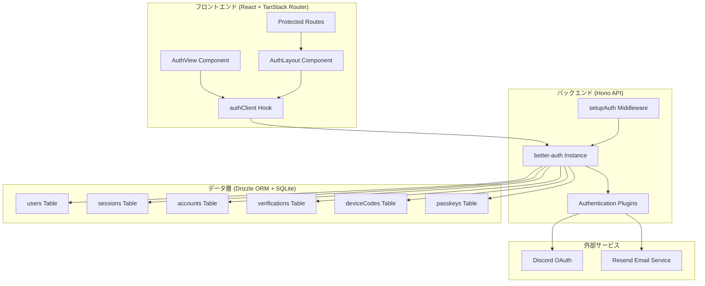
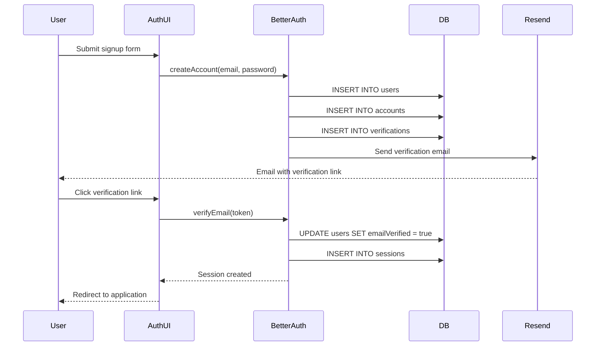
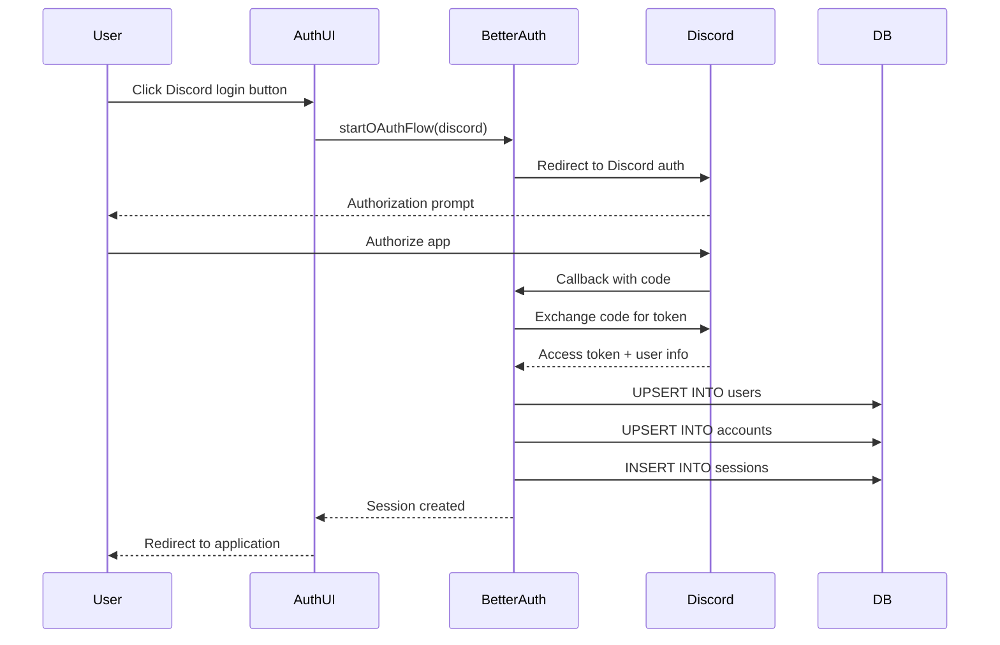
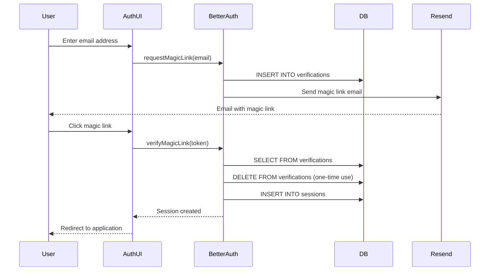
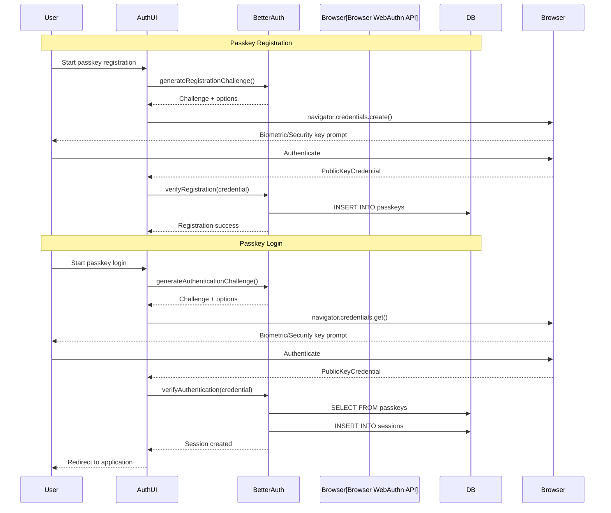
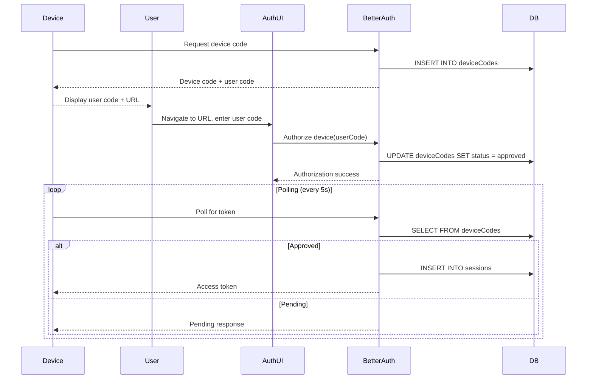
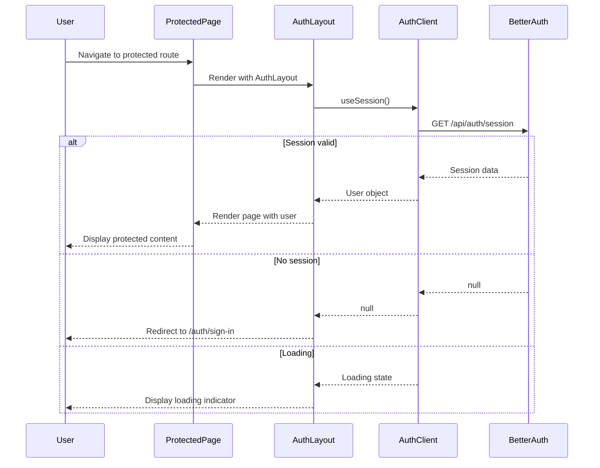
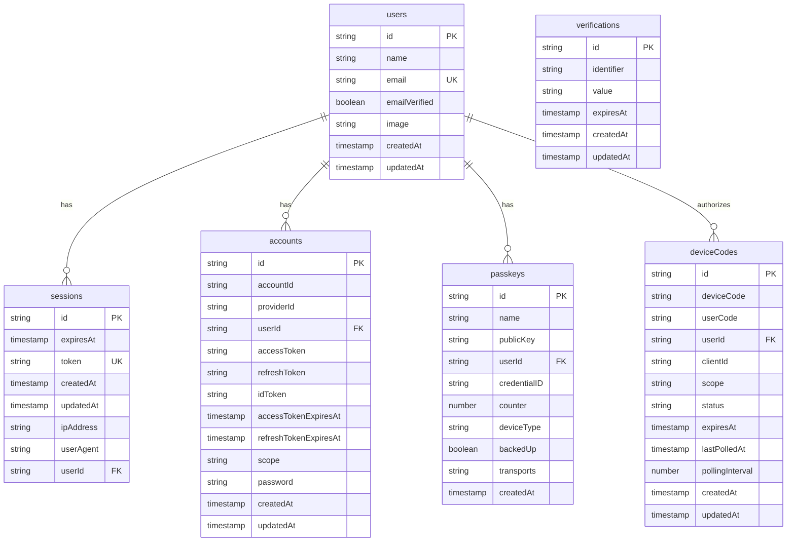
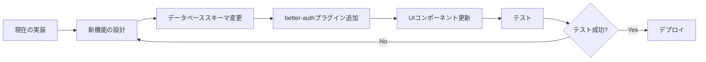

# Technical Design Document: user-authentication

## Overview

**Purpose**: Aim AI Coachアプリケーションにおける包括的なユーザー認証システムを提供する。本機能は、better-authフレームワークをベースとした6種類の認証方式、セキュアなセッション管理、メール検証、および保護ルートのアクセス制御を実現する。

**Users**: Aim AI Coachのエンドユーザー(FPSプレイヤー)、APIクライアント、デバイス(TV/IoT)が認証システムを利用する。

**Impact**: 本設計は既存実装を文書化するものであり、実装済みのシステムへの変更は行わない。

### Goals
- 6種類の認証方式による柔軟なログインオプション提供
- セキュアなセッション管理(7日間有効、15分キャッシュ)
- メール検証による信頼性の高いユーザー登録
- 保護ルートによるアクセス制御
- 既存実装の完全なドキュメント化

### Non-Goals
- 新規実装は行わない(既存実装が要件を100%満たしているため)
- 2要素認証(2FA)の追加
- パスワードリセットフローの強化
- セッション管理UI(アクティブセッション表示)

## Architecture

> 詳細な調査結果は`research.md`を参照。本セクションではアーキテクチャ境界と明示的な契約に焦点を当てる。

### Existing Architecture Analysis

**現在のアーキテクチャパターン**:
- **レイヤードアーキテクチャ**: フロントエンド(React/TanStack Start) / バックエンド(Hono) / データ(Drizzle ORM + SQLite)
- **プラグインアーキテクチャ**: better-authプラグインによる認証方式の拡張
- **ミドルウェアパターン**: Hono認証ミドルウェアによる横断的関心事の分離
- **コンポーネントラッパーパターン**: AuthLayoutによる保護ルートの実装

**既存ドメイン境界**:
- **認証ドメイン** (`api/auth/`, `api/middleware/auth.ts`)
- **データ永続化ドメイン** (`api/db/schema.ts`)
- **UI/プレゼンテーション層** (`src/components/layout/auth.tsx`, `src/routes/auth/`)

**統合ポイント**:
- **Hono API**: `/api/auth/*` エンドポイント
- **React Hooks**: `useSession()` によるクライアントサイド認証状態管理
- **AuthLayout**: 保護ルートラッパーコンポーネント

**技術的負債**:
なし (実装は要件を完全に満たしており、保守性も高い)

### Architecture Pattern & Boundary Map



**Architecture Integration**:
- **Selected pattern**: レイヤードアーキテクチャ + プラグインアーキテクチャ
  - **Rationale**: 関心の分離、拡張性、保守性のバランスが最適
- **Domain/feature boundaries**:
  - **認証ドメイン**: 認証処理、セッション管理、メール検証
  - **データドメイン**: ユーザー情報、セッション、アカウントの永続化
  - **UIドメイン**: 認証フォーム、保護ルートのアクセス制御
- **Existing patterns preserved**:
  - Hono API routing pattern
  - TanStack Router file-based routing
  - Drizzle ORMスキーマ定義パターン
  - Reactコンポーネント構成パターン
- **New components rationale**: なし (既存実装で完結)
- **Steering compliance**:
  - `tech.md`: TypeScript strict mode, Drizzle ORM, Hono, TanStack Start使用
  - `structure.md`: `api/`と`src/`の明確な分離

### Technology Stack

#### Backend
- **Framework**: Hono 4.10.4
  - **Role**: API routing, middleware管理
- **Authentication**: better-auth (latest)
  - **Role**: 認証フレームワーク、プラグインエコシステム
  - **Plugins**: deviceAuthorization, bearer, passkey, magicLink, reactStartCookies
- **Database ORM**: Drizzle ORM 0.44.7
  - **Role**: 型安全なデータベースクエリ、スキーマ管理
- **Database**: LibSQL (Turso)
  - **Role**: SQLite互換の分散データベース
- **Email Service**: Resend 6.3.0
  - **Role**: メール送信 (検証メール、Magic Link)

#### Frontend
- **Framework**: React 19.2.0 + TanStack Start 1.134.0
  - **Role**: SSR対応のReactフレームワーク
- **Routing**: TanStack Router 1.133.36
  - **Role**: File-based routing
- **Auth UI**: @daveyplate/better-auth-ui 3.2.7
  - **Role**: 認証UIコンポーネント

#### External Services
- **Discord OAuth**: Discord API
  - **Role**: ソーシャルログイン
  - **Integration**: better-auth socialProviders plugin

## System Flows

### Email/Password Authentication Flow



### Discord OAuth Flow



### Magic Link Authentication Flow



### Passkey (WebAuthn) Authentication Flow



### Device Authorization Flow



### Protected Route Access Control Flow



## Requirements Traceability

| 要件 | 要件サマリー | コンポーネント | インターフェース | フロー |
|------|------------|--------------|----------------|--------|
| 1 | メール/パスワード認証 | BetterAuth, AuthUI | emailAndPassword API | Email/Password Flow |
| 2 | Discord OAuth | BetterAuth, AuthUI, Discord | socialProviders.discord | Discord OAuth Flow |
| 3 | Magic Link | BetterAuth, AuthUI, Resend | magicLink plugin | Magic Link Flow |
| 4 | Passkey (WebAuthn) | BetterAuth, AuthUI, Browser | passkey plugin | Passkey Flow |
| 5 | Device Authorization | BetterAuth, Device | deviceAuthorization plugin | Device Authorization Flow |
| 6 | Bearer Token | BetterAuth, API Client | bearer plugin | - |
| 7 | セッション管理 | BetterAuth, SessionTable | session config | All authentication flows |
| 8 | メール検証 | BetterAuth, Resend | emailVerification | Email/Password Flow |
| 9 | 保護ルート | AuthLayout, Protected Pages | AuthLayout component | Protected Route Flow |
| 10 | 認証UI | AuthUI (@daveyplate/better-auth-ui) | AuthView component | All authentication flows |
| 11 | データ永続化 | Drizzle ORM, SQLite | Database schema | - |
| 12 | セキュリティ | BetterAuth, Hono | session, trusted origins | - |

## Components and Interfaces

### Backend Layer

#### BetterAuthInstance

**Responsibility & Boundaries**
- **Primary Responsibility**: 認証処理の中核、全認証方式の統合管理
- **Domain Boundary**: 認証ドメイン
- **Data Ownership**: セッション、認証トークン、認証状態
- **Transaction Boundary**: 認証処理全体

**Dependencies**
- **Inbound**: `setupAuth` middleware, AuthClient (frontend)
- **Outbound**: Drizzle ORM, Resend, Discord OAuth
- **External**: better-auth framework, better-auth plugins

**Contract Definition**

```typescript
// 実装: api/auth/index.ts
import { type DB } from "better-auth/adapters/drizzle";

// createAuth関数のパラメータ型
interface CreateAuthParams {
  db: DB;
  baseURL: string;
  secret: string;
  trustedOrigins: string[];
  discord: {
    clientId: string;
    clientSecret: string;
    redirectURI?: string;
  };
  sendMail: (
    data: { email: string; url: string; token: string },
    request?: Request,
  ) => Promise<void> | void;
}

// BetterAuth設定型
interface BetterAuthConfig {
  secret: string;
  trustedOrigins: string[];
  baseURL: string;
  database: DrizzleAdapter;
  session: SessionConfig;
  socialProviders: {
    discord: DiscordConfig;
  };
  emailAndPassword: EmailPasswordConfig;
  emailVerification: EmailVerificationConfig;
  plugins: AuthPlugin[];
}

interface SessionConfig {
  expiresIn: number;        // セッション有効期限 (秒): 60 * 60 * 24 * 7 = 7日間
  updateAge: number;         // セッション更新間隔 (秒): 60 * 60 * 24 = 24時間
  cookieCache: {
    enabled: boolean;        // true: キャッシュ有効
    maxAge: number;          // キャッシュ期限 (秒): 15 * 60 = 15分
  };
}

interface EmailPasswordConfig {
  enabled: boolean;                    // true: メール/パスワード認証有効
  requireEmailVerification: boolean;   // true: メール検証必須
}

interface EmailVerificationConfig {
  sendVerificationEmail: (
    params: { user: User; url: string; token: string },
    request?: Request
  ) => Promise<void>;
  autoSignInAfterVerification: boolean; // true: 検証後自動ログイン
  sendOnSignUp: boolean;                // true: サインアップ時にメール送信
}

interface DiscordConfig {
  clientId: string;         // DISCORD_CLIENT_ID
  clientSecret: string;     // DISCORD_CLIENT_SECRET
  redirectURI?: string;     // オプション: カスタムリダイレクトURI
}
```

**Preconditions**:
- 環境変数 (`BETTER_AUTH_SECRET`, `AUTH_BASE_URL`, etc.) が設定済み
- データベース接続が確立済み

**Postconditions**:
- 認証処理が成功した場合、セッションが作成される
- 認証エラーの場合、適切なエラーレスポンスが返される

**Invariants**:
- セッションは常に有効期限を持つ
- パスワードは常にハッシュ化される
- メール検証が必須の場合、未検証ユーザーはログインできない

#### setupAuth Middleware

**Responsibility & Boundaries**
- **Primary Responsibility**: Hono APIへのbetter-auth統合
- **Domain Boundary**: ミドルウェア層
- **Data Ownership**: なし (BetterAuthInstanceへ委譲)
- **Transaction Boundary**: なし

**Dependencies**
- **Inbound**: Hono app
- **Outbound**: BetterAuthInstance
- **External**: Resend, Cloudflare bindings

**Contract Definition**

```typescript
interface SetupAuthMiddleware {
  (c: Context<{ Bindings: CloudflareBindings; Variables: Variables }>, next: Next): Promise<Response | void>;
}

interface Variables {
  auth: ReturnType<typeof createAuth>;
  db: DrizzleDatabase;
}
```

**Preconditions**:
- データベース接続がミドルウェアチェーンで先に確立されている
- 環境変数がバインディングで利用可能

**Postconditions**:
- `c.var.auth` にBetterAuthInstanceが設定される

### Frontend Layer

#### AuthClient (authClient)

**Responsibility & Boundaries**
- **Primary Responsibility**: クライアントサイドの認証状態管理
- **Domain Boundary**: クライアント認証層
- **Data Ownership**: クライアント側セッション状態
- **Transaction Boundary**: なし

**Dependencies**
- **Inbound**: React components (AuthLayout, AuthView, etc.)
- **Outbound**: Backend BetterAuth API (`/api/auth/*`)
- **External**: better-auth/react

**Contract Definition**

```typescript
interface AuthClientConfig {
  baseURL: string;
  plugins: AuthPlugin[];
  fetchOptions: {
    credentials: 'include' | 'omit' | 'same-origin';
  };
}

interface UseSessionReturn {
  data: {
    user: User | null;
    session: Session | null;
  } | null;
  isPending: boolean;
  error: Error | null;
}

interface User {
  id: string;
  name: string;
  email: string;
  emailVerified: boolean;
  image: string | null;
  createdAt: Date;
  updatedAt: Date;
}

interface Session {
  id: string;
  token: string;
  userId: string;
  expiresAt: Date;
  ipAddress: string | null;
  userAgent: string | null;
}
```

**Preconditions**:
- ブラウザ環境でのみ動作
- Cookieが有効

**Postconditions**:
- `useSession()` はセッション状態を返す
- セッションが無効な場合、`null` を返す

#### AuthLayout Component

**Responsibility & Boundaries**
- **Primary Responsibility**: 保護ルートのアクセス制御
- **Domain Boundary**: UIプレゼンテーション層
- **Data Ownership**: なし (AuthClientへ委譲)
- **Transaction Boundary**: なし

**Dependencies**
- **Inbound**: Protected route pages
- **Outbound**: AuthClient (`useSession` hook)
- **External**: @daveyplate/better-auth-ui

**Contract Definition**

```typescript
// 実装: src/components/layout/auth.tsx
import type { Auth } from "../../../api/variables";

interface AuthLayoutProps {
  children: (user: Auth["$Infer"]["Session"]["user"]) => React.ReactNode;
}

// Auth型定義 (api/variables.ts)
type Auth = ReturnType<typeof createAuth>;

// User型 (better-authから推論)
type User = {
  id: string;
  name: string;
  email: string;
  emailVerified: boolean;
  image: string | null;
  createdAt: Date;
  updatedAt: Date;
};

interface AuthLayoutBehavior {
  // AuthLoading: セッション読み込み中 → "Loading..." 表示
  // SignedIn: 認証済みユーザー → children(data.user) を表示
  // SignedOut: 未認証ユーザー → RedirectToSignIn (/auth/sign-in へリダイレクト)
}

// 使用例
export const AuthLayout = ({ children }: AuthLayoutProps) => {
  const { data } = useSession();
  return (
    <>
      <AuthLoading><span>Loading...</span></AuthLoading>
      <SignedIn>{data?.user ? children(data?.user) : null}</SignedIn>
      <SignedOut><RedirectToSignIn /></SignedOut>
    </>
  );
};
```

**Preconditions**:
- AuthClientが初期化済み

**Postconditions**:
- 認証済みユーザー: `children(user)` がレンダリングされる
- 未認証ユーザー: `/auth/sign-in` へリダイレクト
- ローディング中: ローディングインジケーター表示

#### AuthView Component

**Responsibility & Boundaries**
- **Primary Responsibility**: 認証UIの表示 (サインイン、サインアップ、パスワードリセット等)
- **Domain Boundary**: UIプレゼンテーション層
- **Data Ownership**: なし
- **Transaction Boundary**: なし

**Dependencies**
- **Inbound**: `/auth/$authView` route
- **Outbound**: AuthClient (via @daveyplate/better-auth-ui)
- **External**: @daveyplate/better-auth-ui

**Contract Definition**

```typescript
interface AuthViewProps {
  pathname: string; // 'sign-in' | 'sign-up' | 'forgot-password' | 'verify-email' | 'callback' | 'sign-out'
}
```

**Preconditions**:
- `pathname` が有効な認証ビュー名

**Postconditions**:
- 該当する認証UIがレンダリングされる

### Data Layer

#### Database Schema

すべてのテーブルはDrizzle ORMで定義され、better-authが管理する。

##### users Table

```typescript
interface UsersTable {
  id: string;                    // Primary Key
  name: string;
  email: string;                 // Unique
  emailVerified: boolean;        // Default: false
  image: string | null;
  createdAt: Date;               // Default: NOW()
  updatedAt: Date;               // Auto-updated
}
```

##### sessions Table

```typescript
interface SessionsTable {
  id: string;                    // Primary Key
  expiresAt: Date;
  token: string;                 // Unique
  createdAt: Date;
  updatedAt: Date;
  ipAddress: string | null;
  userAgent: string | null;
  userId: string;                // Foreign Key → users.id (CASCADE DELETE)
}

// Indexes:
// - sessions_user_id_idx ON userId
// - sessions_expires_at_idx ON expiresAt
```

##### accounts Table

```typescript
interface AccountsTable {
  id: string;                    // Primary Key
  accountId: string;
  providerId: string;            // 'credential' | 'discord'
  userId: string;                // Foreign Key → users.id (CASCADE DELETE)
  accessToken: string | null;
  refreshToken: string | null;
  idToken: string | null;
  accessTokenExpiresAt: Date | null;
  refreshTokenExpiresAt: Date | null;
  scope: string | null;
  password: string | null;       // Hashed password
  createdAt: Date;
  updatedAt: Date;
}

// Indexes:
// - accounts_provider_account_idx ON (providerId, accountId)
// - accounts_user_id_idx ON userId
```

##### verifications Table

```typescript
interface VerificationsTable {
  id: string;                    // Primary Key
  identifier: string;            // Email address
  value: string;                 // Verification token
  expiresAt: Date;
  createdAt: Date;
  updatedAt: Date;
}
```

##### deviceCodes Table

```typescript
interface DeviceCodesTable {
  id: string;                    // Primary Key
  deviceCode: string;
  userCode: string;
  userId: string | null;         // Foreign Key → users.id (CASCADE DELETE)
  clientId: string | null;
  scope: string | null;
  status: string;                // 'pending' | 'approved' | 'denied' | 'expired'
  expiresAt: Date;
  lastPolledAt: Date | null;
  pollingInterval: number | null; // Seconds
  createdAt: Date;
  updatedAt: Date;
}

// Indexes:
// - device_codes_user_id_idx ON userId
```

##### passkeys Table

```typescript
interface PasskeysTable {
  id: string;                    // Primary Key
  name: string | null;
  publicKey: string;
  userId: string | null;         // Foreign Key → users.id (CASCADE DELETE)
  credentialID: string;
  counter: number | null;
  deviceType: string;
  backedUp: boolean;
  transports: string;
  createdAt: Date;
}
```

**Data Integrity**:
- すべての外部キーはカスケード削除
- 適切なインデックスによるクエリ最適化
- タイムスタンプの自動管理

## Data Models

### Domain Model

**Core Aggregates**:

- **User Aggregate**:
  - **Root**: User entity
  - **Entities**: Account (OAuth/パスワード), Session, Passkey
  - **Business Rule**: メール検証が必須の場合、未検証ユーザーはログインできない
  - **Consistency Boundary**: ユーザー削除時、関連するセッション、アカウント、Passkeyも削除される

- **Verification Aggregate**:
  - **Root**: Verification entity (メール検証、Magic Link)
  - **Business Rule**: トークンは1回限りの使用
  - **Consistency Boundary**: 検証成功後、トークンは削除される

- **Device Authorization Aggregate**:
  - **Root**: DeviceCode entity
  - **Business Rule**: ポーリング間隔は5秒、有効期限は3ヶ月
  - **Consistency Boundary**: デバイスコードの承認/拒否/期限切れ

**Business Rules & Invariants**:
- パスワードは常にハッシュ化される (better-authが自動処理)
- セッションは有効期限を過ぎると無効化される
- Discord OAuthトークンはリフレッシュ可能
- Passkeyは複数登録可能

### Logical Data Model

**Entity Relationships**:



**Referential Integrity**:
- すべての外部キーはカスケード削除 (`onDelete: "cascade"`)
- ユーザー削除時、関連データ（sessions, accounts, deviceCodes, passkeys）も自動削除

**Index Strategy**:

| テーブル | インデックス | 目的 | カラム |
|---------|------------|------|--------|
| sessions | sessions_user_id_idx | ユーザーごとのセッション取得を高速化 | userId |
| sessions | sessions_expires_at_idx | 期限切れセッションのクリーンアップ用 | expiresAt |
| accounts | accounts_provider_account_idx | OAuth認証の高速検索 | providerId, accountId |
| accounts | accounts_user_id_idx | ユーザーのアカウント関連付け用 | userId |
| deviceCodes | device_codes_user_id_idx | デバイス認証の参照用 | userId |

**Performance Considerations**:
- **sessions_expires_at_idx**: 定期的なセッションクリーンアップクエリ（`DELETE FROM sessions WHERE expiresAt < NOW()`）を高速化
- **accounts_provider_account_idx**: Discord OAuth認証時の既存アカウント検索（`SELECT * FROM accounts WHERE providerId = 'discord' AND accountId = '...'`）を高速化
- **Composite Index**: provider + accountId の複合インデックスにより、OAuth認証のパフォーマンスを最適化

**Temporal Aspects**:
- `createdAt`, `updatedAt` による監査証跡
- セッション、検証トークン、デバイスコードの有効期限管理

## Error Handling

### Error Strategy

better-authのデフォルトエラーハンドリングを使用し、適切なHTTPステータスコードとエラーメッセージを返す。

### Error Categories and Responses

**User Errors (4xx)**:
- **400 Bad Request**: 無効な入力 (メールアドレス形式不正、パスワード強度不足)
  - **Response**: フィールドレベルのバリデーションエラーメッセージ
- **401 Unauthorized**: 認証失敗 (パスワード不正、セッション期限切れ)
  - **Response**: "メールアドレスまたはパスワードが正しくありません"
- **403 Forbidden**: メール未検証
  - **Response**: "メールアドレスを検証してください"
- **404 Not Found**: ユーザーが存在しない
  - **Response**: "ユーザーが見つかりません"
- **409 Conflict**: メールアドレス重複
  - **Response**: "このメールアドレスは既に使用されています"

**System Errors (5xx)**:
- **500 Internal Server Error**: サーバーエラー
  - **Response**: "エラーが発生しました。しばらくしてから再度お試しください"
  - **Logging**: エラー詳細をサーバーログに記録
- **503 Service Unavailable**: 外部サービス障害 (Resend, Discord)
  - **Response**: "サービスが一時的に利用できません"
  - **Recovery**: リトライ機構 (better-authのデフォルト動作)

**Business Logic Errors (422)**:
- **Magic Link期限切れ**: "リンクの有効期限が切れています。新しいリンクを送信してください"
- **Device Code期限切れ**: "デバイスコードの有効期限が切れています。新しいコードを取得してください"
- **Passkey認証失敗**: "認証に失敗しました。別の方法でログインしてください"

### Monitoring

- **Error Tracking**: すべてのエラーをサーバーログに記録
- **Logging**: better-authのデフォルトログ + カスタムログ (必要に応じて)
- **Health Monitoring**: セッション作成率、認証失敗率、メール送信成功率

## Testing Strategy

### Unit Tests

既存実装のテストケース定義 (実装済み機能の検証):

1. **パスワードハッシュ化**: パスワードが平文で保存されないことを確認
2. **セッション有効期限**: セッションが7日後に期限切れになることを確認
3. **メール検証トークン生成**: トークンが一意であることを確認
4. **Magic Linkトークン検証**: 1回限りの使用が保証されることを確認
5. **Device Codeポーリング間隔**: 5秒間隔でポーリングされることを確認

### Integration Tests

認証フロー全体のE2Eテスト:

1. **メール/パスワード登録→検証→ログイン**: エンドツーエンドフロー
2. **Discord OAuth認証**: リダイレクト→コールバック→セッション作成
3. **Magic Link認証**: リクエスト→メール送信→リンククリック→ログイン
4. **Passkey登録→認証**: WebAuthn API統合テスト
5. **Device Authorization**: デバイスコードリクエスト→承認→トークン取得

### E2E/UI Tests

ユーザー体験の検証:

1. **サインアップフォーム**: バリデーション、エラーメッセージ表示
2. **サインインフォーム**: ログイン成功→保護ルートへリダイレクト
3. **保護ルートアクセス**: 未認証時→サインインページへリダイレクト
4. **セッション期限切れ**: 7日後に再認証が必要になることを確認
5. **ログアウト**: セッション削除→未認証状態への遷移

### Performance/Load

1. **セッション読み込み**: キャッシュ有効時のレスポンス時間 (< 100ms)
2. **並行ログイン**: 100ユーザーの同時認証処理
3. **データベースクエリ**: インデックス使用時のクエリパフォーマンス
4. **メール送信**: Resend APIのレスポンス時間

## Security Considerations

### Threat Modeling

- **パスワード保護**: better-authによるハッシュ化 (bcrypt/argon2)
- **セッショントークン**: ランダム生成、HTTPOnlyクッキーで保護
- **XSS対策**: HTTPOnlyクッキー使用
- **CSRF対策**: SameSite=Lax/Strict設定 (better-authデフォルト)
- **中間者攻撃**: HTTPS必須 (本番環境)

### Authentication and Authorization

- **認証**: 6種類の認証方式をサポート
- **認可**: セッションベースの保護ルート
- **セッション管理**: 7日間有効、15分キャッシュ

### Data Protection

- **パスワード**: ハッシュ化保存、平文での送信禁止
- **トークン**: 一時的、有効期限付き
- **Cookieセキュリティ**: `httpOnly`, `secure`, `sameSite` 設定

### Security Configuration Details

#### パスワードハッシュ化（要件12-AC1）

```typescript
// better-authのデフォルト設定を使用
// 実装: api/auth/index.ts
emailAndPassword: {
  enabled: true,
  requireEmailVerification: true,
}
```

**ハッシュアルゴリズム**: better-authのデフォルト（bcryptまたはargon2、バージョンにより異なる）を使用。ソルト付きハッシュによりレインボーテーブル攻撃を防御。

#### HTTPS接続（要件12-AC2）

```typescript
// 本番環境では必須
// 実装: api/auth/index.ts
baseURL: process.env.BASE_URL, // https://yourdomain.com
```

**設定**:
- **開発環境**: `http://localhost:3000` (HTTPSなし、ローカル開発用)
- **本番環境**: `https://yourdomain.com` (HTTPS必須)
- **Cookie Secure属性**: 本番環境では自動的に `secure: true` が設定される

#### Cookie設定（要件12-AC3）

```typescript
// better-authのデフォルト設定
// 実装: api/auth/index.ts
session: {
  expiresIn: 60 * 60 * 24 * 7,        // 7日間
  updateAge: 60 * 60 * 24,             // 24時間ごとに更新
  cookieCache: {
    enabled: true,
    maxAge: 15 * 60,                    // 15分キャッシュ
  },
}
```

**Cookie属性**:
- **httpOnly**: `true` (JavaScriptからのアクセス防止、XSS対策)
- **secure**: `true` (本番環境、HTTPS接続時のみ送信)
- **sameSite**: `'lax'` (CSRF攻撃の軽減、GET以外のクロスサイトリクエストをブロック)
- **path**: `/` (アプリケーション全体で有効)
- **domain**: 設定なし (現在のドメインのみ)

#### 信頼オリジン設定（要件12-AC4）

```typescript
// 実装: api/auth/index.ts
trustedOrigins: [
  "http://localhost:3000",      // 開発環境
  "https://yourdomain.com",      // 本番環境
  // 必要に応じて追加のオリジンを設定
]
```

**役割**: CORS（Cross-Origin Resource Sharing）の制御。認証APIへのアクセスを信頼されたオリジンに制限し、不正なサイトからのリクエストをブロック。

#### 環境変数管理（要件12-AC5）

```typescript
// 実装: api/env.ts (T3 Env使用)
import { createEnv } from "@t3-oss/env-core";
import { z } from "zod";

export const env = createEnv({
  server: {
    BETTER_AUTH_SECRET: z.string().min(32),
    DISCORD_CLIENT_ID: z.string(),
    DISCORD_CLIENT_SECRET: z.string(),
    RESEND_API_KEY: z.string(),
    DATABASE_URL: z.string().url(),
    // ... 他の環境変数
  },
  runtimeEnv: process.env,
});
```

**ベストプラクティス**:
- **型安全性**: T3 Envによる環境変数の型定義とバリデーション
- **秘密鍵の管理**: `.env`ファイルに保存、`.gitignore`に追加（バージョン管理から除外）
- **最小権限の原則**: 各環境変数は必要最小限のアクセス権限を持つ
- **キーローテーション**: `BETTER_AUTH_SECRET`は定期的に更新することを推奨

### Security Checklist

| 要件 | 設定 | 実装箇所 | ステータス |
|------|------|---------|-----------|
| AC1: パスワードハッシュ化 | bcrypt/argon2 | better-authデフォルト | ✅ 実装済み |
| AC2: HTTPS接続 | 本番環境で必須 | `baseURL` 設定 | ✅ 実装済み |
| AC3: Cookie設定 | httpOnly, secure, sameSite | better-authデフォルト | ✅ 実装済み |
| AC4: 信頼オリジン | trustedOrigins配列 | `api/auth/index.ts` | ✅ 実装済み |
| AC5: 環境変数管理 | T3 Env | `api/env.ts` | ✅ 実装済み |

### Compliance

- **GDPR**: ユーザーデータ削除時、関連データもカスケード削除
- **セキュリティベストプラクティス**: better-authのデフォルト設定に準拠

## Performance & Scalability

### Target Metrics

- **セッション読み込み**: < 100ms (キャッシュ有効時)
- **認証API**: < 500ms (Discord OAuth除く)
- **データベースクエリ**: < 50ms (インデックス使用)

### Scaling Approaches

- **データベース**: LibSQL (Turso) による分散データベース
- **セッションキャッシュ**: 15分間のクッキーキャッシュでDB負荷軽減
- **水平スケーリング**: Cloudflare Workersでのステートレスデプロイ

### Caching Strategies

- **セッションキャッシュ**: 15分間のクッキーキャッシュ
- **データベース**: Tursoのエッジキャッシュ (設定による)
- **CDN**: 静的アセット (認証UI) のキャッシュ

## Migration Strategy

本機能は既存実装のドキュメント化のため、マイグレーション不要。

将来的な認証機能の拡張 (2FA、パスワードリセット強化等) を実施する場合のマイグレーションパターン:



**Process**:
- **Phase 1**: 要件定義と設計
- **Phase 2**: データベーススキーマ変更 (Drizzle migration)
- **Phase 3**: better-authプラグイン追加または設定変更
- **Phase 4**: UIコンポーネント更新
- **Phase 5**: テストと検証
- **Phase 6**: 段階的デプロイ

**Rollback Triggers**:
- テスト失敗
- 認証エラー率の異常な上昇
- パフォーマンスの著しい低下

**Validation Checkpoints**:
- 各フェーズ後のテスト実施
- 本番デプロイ前の統合テスト
- デプロイ後のモニタリング
